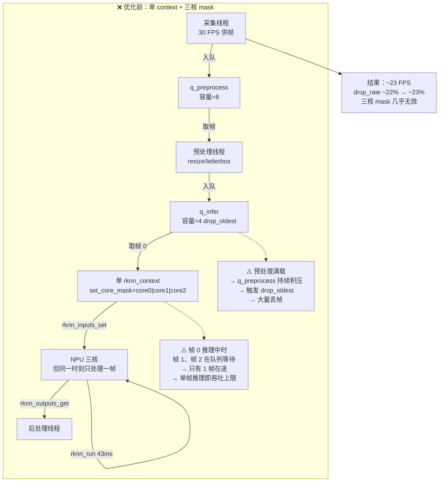
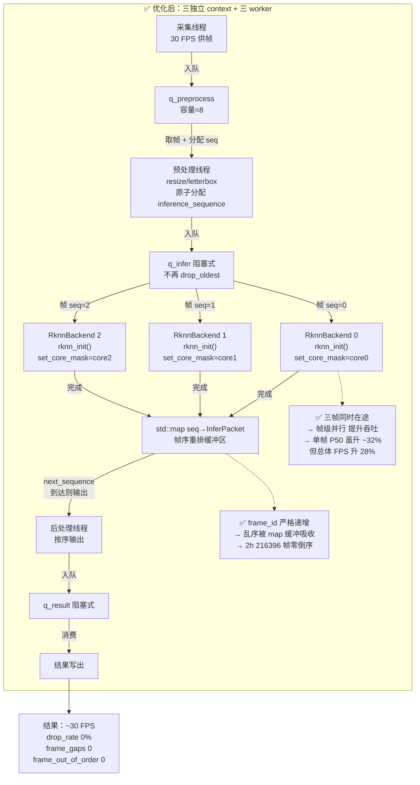

# troubleshooting

## 目的

记录项目三 C++ 实时视频流推理 Pipeline 的已知问题、风险、阻塞项与回归结果。

说明：

- 项目三承接项目一/二的 YOLO11n 模型和 INT8 PTQ engine，在 Jetson 8GB / RK3588 8GB 上构建多线程实时推理 pipeline。
- 核心验证包括：视频文件/摄像头采集、TensorRT/RKNN 多后端推理、帧序保证、长稳可靠性、BDD100K MOT 质量对齐。
- 所有问题的结论必须可追溯到 run、raw result、日志、配置和源码。

与 `failure_and_fallback.md` 的分工：

- 本文件是**问题库主文件**，负责记录错误内容、退出码、前因后果、详细修复过程和回归验证。
- `failure_and_fallback.md` 只保留异常恢复 / CPU fallback / service recovery 的结构化主表、执行入口和验收口径。
- 如果某个 failure case 需要解释“为什么失败、为什么这样修、为什么现在算通过或降级”，以本文件为准；`failure_and_fallback.md` 只保留 `related_troubleshooting_id` 和最小必要说明。

## 问题索引

### P3-TRB-20260615-001
- **日期**: 2026-06-15
- **目标**: Jetson 8GB
- **后端**: TensorRT
- **类型**: 质量链路污染
- **摘要**: BDD100K 质量评估误用 `drop_oldest` 实时主线结果，frame gap 被误写进质量链路
- **状态**: `fixed`
- **target**: jetson_8gb · tensorrt

### P3-TRB-20260616-001
- **日期**: 2026-06-16
- **目标**: Jetson 8GB
- **后端**: TensorRT
- **类型**: 任务级质量不达标
- **摘要**: no-drop 后质量证据有效，但 BDD100K MOT 检测 Recall 长期低于 0.50 阈值
- **状态**: `closed_nonblocking_task_fail`
- **target**: jetson_8gb · tensorrt

### P3-TRB-20260616-002
- **日期**: 2026-06-16
- **目标**: Jetson 8GB
- **后端**: TensorRT
- **类型**: 前后处理漂移
- **摘要**: C++ 前后处理未完整消费 model config，存在实现漂移风险
- **状态**: `fixed`
- **target**: jetson_8gb · tensorrt

### P3-TRB-20260616-003
- **日期**: 2026-06-16
- **目标**: Jetson 8GB
- **后端**: TensorRT
- **类型**: 对齐配置错误
- **摘要**: fixed-input 对齐首轮误用 `drop_oldest` 配置，current raw 大量缺帧
- **状态**: `fixed`
- **target**: jetson_8gb · tensorrt

### P3-TRB-20260616-004
- **日期**: 2026-06-16
- **目标**: Jetson 8GB
- **后端**: TensorRT
- **类型**: artifact 选择错误
- **摘要**: runtime600 主线名义 INT8 PTQ，首轮实际用了 FP16 engine
- **状态**: `fixed`
- **target**: jetson_8gb · tensorrt

### P3-TRB-20260617-005
- **日期**: 2026-06-17
- **目标**: Jetson 8GB
- **后端**: TensorRT
- **类型**: 输入节流缺失
- **摘要**: video_file 未按源时间基准节流，离线文件高速灌流触发伪高压 drop_oldest
- **状态**: `fixed_verified`
- **target**: jetson_8gb · tensorrt

### P3-TRB-20260617-006
- **日期**: 2026-06-17
- **目标**: Jetson 8GB
- **后端**: TensorRT
- **类型**: 指标口径修正
- **摘要**: `drop_frame_rate_max` 不是整轮丢帧率，已修正为 `drop_frame_rate_total_estimated`
- **状态**: `fixed`
- **target**: jetson_8gb · tensorrt

### P3-TRB-20260617-007
- **日期**: 2026-06-17
- **目标**: Jetson 8GB
- **后端**: TensorRT
- **类型**: 输出瓶颈定位
- **摘要**: 输出视频写盘显著拉高 output_ms，是 playlist-paced 主线丢帧主要瓶颈
- **状态**: `verified_root_cause`
- **target**: jetson_8gb · tensorrt

### P3-TRB-20260618-005
- **日期**: 2026-06-18
- **目标**: Jetson 8GB
- **后端**: TensorRT
- **类型**: 队列策略传参失效
- **摘要**: QUEUE_POLICY/QUEUE_PUSH_TIMEOUT_MS 名义切换但实际仍按 drop_oldest 执行
- **状态**: `fixed_verified`
- **target**: jetson_8gb · tensorrt

### P3-TRB-20260618-007
- **日期**: 2026-06-18
- **目标**: cross_target
- **后端**: mixed
- **类型**: schema scope 污染
- **摘要**: legacy inherited raw 与跨项目对照 raw 混入 03I formal scope
- **状态**: `fixed_verified`
- **target**: cross_target · mixed

### P3-TRB-20260619-008
- **日期**: 2026-06-19
- **目标**: Jetson 8GB
- **后端**: TensorRT
- **类型**: 代码路径未实现
- **摘要**: 文档长期把 03A/03C/IMX219 写成"待补证"，实际部分代码路径未真正打通
- **状态**: `fixed_verified_closed_by_formal_reruns`
- **target**: jetson_8gb · tensorrt

### P3-TRB-20260619-009
- **日期**: 2026-06-19
- **目标**: Jetson 8GB
- **后端**: TensorRT
- **类型**: live-source 性能演进
- **摘要**: IMX219 14.6→22→49 FPS 演进；Argus 放弃主线化；720p60 mode5 runtime600 通过
- **状态**: `resolved_with_v4l2_raw_720p60_runtime600_argus_abandoned`
- **target**: jetson_8gb · tensorrt

### P3-TRB-20260619-010
- **日期**: 2026-06-19
- **目标**: Jetson 8GB
- **后端**: TensorRT
- **类型**: 断流方法安全化
- **摘要**: active capture 期间 sysfs unbind 导致 SSH 断开，默认断流已切到应用内安全注入
- **状态**: `mitigation_verified_on_board`
- **target**: jetson_8gb · tensorrt

### P3-TRB-20260619-011
- **日期**: 2026-06-19
- **目标**: RK3588 8GB
- **后端**: RKNN
- **类型**: 视频方向修复
- **摘要**: 80 MOV 包含 33 clockwise + 47 counterclockwise track matrix，修复后 recall=0.446
- **状态**: `resolved_with_quality_gap`
- **target**: rk3588_8gb · rknn

### P3-TRB-20260620-012
- **日期**: 2026-06-20
- **目标**: RK3588 8GB
- **后端**: RKNN
- **类型**: 任务级 Recall 不达标
- **摘要**: AP50=0.351 通过，但 Recall=0.446<0.50；与 Jetson 同类失败一致
- **状态**: `closed_nonblocking_task_fail`
- **target**: rk3588_8gb · rknn

### P3-TRB-20260620-013
- **日期**: 2026-06-20
- **目标**: Jetson 8GB
- **后端**: TensorRT
- **类型**: warm-up 稳定性
- **摘要**: IMX219 fixed_10bit 4h 首帧 CUDNN 失败已由 warmupfix 复测收住
- **状态**: `fixed_verified`
- **target**: jetson_8gb · tensorrt

### P3-TRB-20260621-013
- **日期**: 2026-06-21
- **目标**: RK3588 8GB
- **后端**: RKNN
- **类型**: 稳定性 trace 策略误配
- **摘要**: 2h 实时 run 6 帧 gap 被 no-drop 门禁误判 exit 3，wrapper 未生成 stability CSV
- **状态**: `fixed_closed`
- **target**: rk3588_8gb · rknn

### P3-TRB-20260617-RK3588-001
- **日期**: 2026-06-17
- **目标**: RK3588 8GB
- **后端**: RKNN
- **类型**: artifact hash 闭环
- **摘要**: 选定 40bce...，板端 hash 与配置一致，COCO2017 5000 张复检通过
- **状态**: `closed_hash_verified_on_board`
- **target**: rk3588_8gb · rknn

### P3-TRB-20260618-RK3588-002
- **日期**: 2026-06-18
- **目标**: RK3588 8GB
- **后端**: RKNN
- **类型**: 构建失败
- **摘要**: build 脚本显式传入 RKNN include/lib 后产出 video_pipeline_app
- **状态**: `fixed`
- **target**: rk3588_8gb · rknn

### P3-TRB-20260618-RK3588-003
- **日期**: 2026-06-18
- **目标**: RK3588 8GB
- **后端**: RKNN
- **类型**: 历史日志污染
- **摘要**: 修复 dmesg 边界后四轮 120s 无新增 timeout/reset，原事件判为历史污染
- **状态**: `closed_historical_event_not_reproduced`
- **target**: rk3588_8gb · rknn

### P3-TRB-20260618-RK3588-004
- **日期**: 2026-06-18
- **目标**: RK3588 8GB
- **后端**: RKNN
- **类型**: 元数据漂移
- **摘要**: board config 携带旧 hash，已补三方一致性校验
- **状态**: `closed_by_project3_artifact_selection_pending_quality`
- **target**: rk3588_8gb · rknn

### P3-TRB-20260618-RK3588-005
- **日期**: 2026-06-18
- **目标**: RK3588 8GB
- **后端**: RKNN
- **类型**: 多核并行/帧序保证
- **摘要**: 三 context 2h 达 30.06 FPS，216396 帧零乱序，7199s 持续验证
- **状态**: `fixed_verified_7199s`
- **target**: rk3588_8gb · rknn

### P3-TRB-20260618-RK3588-006
- **日期**: 2026-06-18
- **目标**: RK3588 8GB
- **后端**: RKNN
- **类型**: 二进制版本不匹配
- **摘要**: 删除旧 build 重建后 CLI 参数生效，1-worker/3-worker A/B 正常
- **状态**: `fixed_verified`
- **target**: rk3588_8gb · rknn

### P3-TRB-20260618-RK3588-007
- **日期**: 2026-06-18
- **目标**: RK3588 8GB
- **后端**: RKNN
- **类型**: 预处理漂移
- **摘要**: pad=0 修复后 630/630 双向匹配，mean IoU=0.999，795 帧零 gap
- **状态**: `fixed_verified_on_board`
- **target**: rk3588_8gb · rknn

### P3-TRB-20260622-014
- **日期**: 2026-06-22
- **目标**: RK3588 8GB
- **后端**: RKNN
- **类型**: 摄像头接入闭环
- **摘要**: Astra S OpenNI 接入、权限、selector、断流、systemd 全部闭环
- **状态**: `fixed_verified_on_board`
- **target**: rk3588_8gb · rknn

### P3-TRB-20260622-015
- **日期**: 2026-06-22
- **目标**: RK3588 8GB
- **后端**: RKNN
- **类型**: 预览窗口可观测性
- **摘要**: HighGUI 关闭判定脆弱点修复，预览窗口稳定显示实时画面
- **状态**: `fixed_user_verified_on_board`
- **target**: rk3588_8gb · rknn

### P3-TRB-20260629-016
- **日期**: 2026-06-29
- **目标**: RDK X5 8GB
- **后端**: BPU
- **类型**: IMX219 live-source 性能收敛
- **摘要**: IMX219 HBN 实时链路初始仅约 18-20 FPS；完成 `rotate180`、benchmark decouple 与 `2 infer / 2 postprocess` 收敛后达到 `30.08 FPS`、`0 drop`、`0 gap`
- **状态**: `fixed_user_verified_on_board`
- **target**: rdk_x5_8gb · bpu

### P3-TRB-20260630-015
- **日期**: 2026-06-30
- **目标**: RDK X5 8GB
- **后端**: BPU
- **类型**: BDD100K batch wrapper 误判
- **摘要**: `PYTHON_BIN=python3` 误判与旧 postcheck 导致 BDD100K 质量评估被提前跳过
- **状态**: `fixed_in_repo_waiting_board_resync`
- **target**: rdk_x5_8gb · bpu

### P3-TRB-20260701-017
- **日期**: 2026-07-01
- **目标**: RDK X5 8GB
- **后端**: BPU
- **类型**: 任务级 Recall 不达标
- **摘要**: full80 正式 aggregate 为 `AP50=0.273229`、`Recall=0.312393`；`0.01-0.25` 离线阈值扫描完全一致，无法继续靠评估阈值拉回 Recall
- **状态**: `closed_nonblocking_task_fail`
- **target**: rdk_x5_8gb · bpu

## 平台状态摘要

| 平台 | 当前主线结论 | 关键指标 | 开放项 |
|---|---|---|---|
| Jetson TensorRT | playlist/noout 主线稳定 | 30 FPS, drop_rate~0.6% | IMX219 720p60 已验证；03A/03C/03D 板端证据补齐中 |
| Jetson IMX219 live | 720p60 mode5 runtime600 pass | 47.67 FPS, 0 drop | 1080p30 约 22 FPS；Argus 已放弃 |
| RK3588 RKNN | 三 context 30 FPS 主线 | 2h 30.06 FPS, 7199s 帧序验证 | Astra S 已闭环；BDD recall 0.446<0.5 |
| RK3588 BDD100K | 方向修复完成，质量门禁未达 | AP50=0.351 pass, Recall=0.446 fail | COCO→BDD 域差，非阻塞 |
| RDK X5 BPU | IMX219 HBN live-source 主线收敛，BDD100K full80 已补齐正式结论 | 2h 30.39 FPS, 0 drop, 0 gap；full80 `AP50=0.273`, `Recall=0.312` | 若继续拉 Recall，只能重跑更低 C++ confidence floor 的 full80；当前已按跨平台一致的非阻塞失败归档 |

## 问题详情

以下各条统一按“错误内容 / 前因后果 / 详细解决过程 / 验证结果或当前状态”展开记录。对原先仅有摘要或叙述体的条目，已经补足触发症状、因果链和修复闭环，确保后续复盘时不用再回推上下文。若问题存在明确错误代码、退出码、异常标识或关键报错串，必须在“错误内容”或“问题现象”开头显式列出，不再只散落在后文叙述中。

### P3-TRB-20260618-RK3588-007 Fixed-input 比较器单向验收风险

| 字段 | 内容 |
|---|---|
| 状态 | `fixed_verified_on_board` |
| 目标 | `rk3588_8gb` |
| 后端 | `rknn` |
| 首次暴露 | Jetson fixed-input 首轮对齐 + RK3588 首轮严格对齐复跑 |
| 直接风险 | 比较器只做 baseline 单向验收时，可能把“current 侧多检 / 实现漂移”误判成通过 |
| 最终验证 | `20260619...pad0` 板端复跑 |

#### 错误内容

- 错误代码 / 退出码：本问题没有单一 app 错误码；首轮错误表现为 trace gap `0 -> 791`，严格门禁阶段的失败语义来自 `unmatched_current_count > 0` 与双向未匹配，不是单个进程退出码。
- 这个问题不是“fixed-input 没跑起来”，而是**fixed-input 比较器最早只证明了 baseline 检测没有丢，却没有严格证明 current 与 baseline 双向一致**。
- 更早的 Jetson 首轮 fixed-input 还误用了实时 `drop_oldest`：795 帧输入最终只保留 5 帧，trace 直接出现 `0 -> 791`，因此那一轮的差异根本不能拿来判断模型、前处理或后处理是否对齐。
- 改成专用 `block`、容量 32、trace 零缺帧配置后，Jetson 80 个 manifest 帧 payload 才完整，baseline 的 633 个检测全部匹配，class match rate 为 `1.0`，mean IoU 为 `0.996638`。但复核 CSV 时又发现：即便 current 侧存在额外检测，只要 baseline 检测都被匹配，旧比较器仍会给出 pass。

#### 前因后果

1. 前因一是**实验口径错误**：fixed-input 本应使用 no-drop、零 gap 的质量链路，但早期误复用**实时主线配置**（**没有考虑摄像头帧率限制，事实上模拟摄像头行为是无法做到从内存读出来直接处理这么快的，我们忽略了摄像头有帧率的事实导致的**），导致输入本身就不完整。
2. 前因二是**门禁设计不完整**：旧比较器 pass 条件只依赖 `total_baseline_detections` 和 `total_matches`，`unmatched_current_count` 只写入 CSV，不进入 pass/fail。
3. 在 Jetson 上，这个缺陷会把“baseline 没丢”的结论放大成“双方完全一致”的假阳性；在 RK3588 上，这个缺陷恰好被首轮严格门禁拦下来，暴露出 current/baseline 实际并未完全对齐。
4. RK3588 首轮严格对齐运行得到 `795/795` 帧、零 gap、零乱序，RKNPU 三 context 正常，但检测对齐只有 `626/630`，baseline/current 检测数为 `630/632`，双向未匹配分别为 `4/6`。这说明问题已经从“输入不完整”收敛成“实现确实有漂移”。
5. 继续追根后发现：项目二实际调用 `preprocess_image_rknn_official()`，其 letterbox 固定 `pad_color=(0,0,0)`；项目三 C++ 则读取通用模型配置的 `pad_value=114`。原 consistency checker 只比较通用 YAML，没有检查 RKNN official helper 的真实 pad 行为，因此早期比较器在 RKNN 路径上存在假阳性空间。

#### 详细解决过程

1. 先把 fixed-input 运行口径改正：统一切到 `queue_policy=block`、`queue_capacity=32`、trace 零缺帧，并把这条链路与实时 `drop_oldest` 主线彻底隔离。
2. 在比较器里保留默认兼容行为，但新增 `--require-no-unmatched-current`，让“current 侧存在额外检测”也能进入失败判定。
3. RK3588 正式 fixed-input 脚本默认启用该开关，同时强制 no-drop 和 trace gap failure，确保板端第一次复跑就能把真实差异挡住，而不是再次放过。
4. 针对 RKNN 预处理漂移，在 RK3588 `board config` 中显式新增 `preprocess_pad_value: 0`，由 C++ 在加载 board config 后覆盖通用模型 pad；Jetson 等其他后端继续保留 `114`。
5. consistency checker 同步改为读取 board config，并按 RKNN official helper 的实际 `pad=0` 行为校验，而不是只检查通用模型 YAML。

#### 验证结果

- `20260619...pad0` 板端复跑后，baseline/current 检测数为 `630/630`，匹配数 `630`，双向未匹配 `0/0`。
- 质量对齐指标恢复为：`class match rate=1.0`、`mean IoU=0.999220`、`mean confidence absolute difference=0`。
- 结论已经从“比较器可能放过问题”收敛成“RK3588 pad 差异已被定位并修复，严格双向门禁通过”，本问题关闭。

---

### P3-TRB-20260618-RK3588-005 单 context 三核无吞吐收益与多 context 帧顺序

| 字段 | 内容 |
|---|---|
| 状态 | `fixed_verified_7199s` |
| 目标 | `rk3588_8gb` |
| 后端 | `rknn` / RKNPU2 |
| 模型 | YOLO11n RKNN INT8 PTQ，SHA256 `40bce507d584498825267287cbb44c8dd860c8ddc3413677767891aeb225b69c` |
| 首次验证 | `20260618_..._core0_ab120`、`20260618_rk3588_8gb_yolo11n_rknn_core012_ab120` |
| 后续验证 | `20260618_rk3588_8gb_yolo11n_rknn_parallel_ab120` |
| 证据来源 | processed summary、runtime/monitor log、`video_pipeline_app.cpp` |

#### 错误内容

- **错误代码 / 异常标识**：本问题没有单一 app 错误码；首轮异常表现是实时 run 指标退化为 `~23 FPS`、`drop_oldest` 持续触发，以及 A/B 中 `core0` 与 `0_1_2` 几乎无性能差异。
- 首轮实时 pipeline 在约 30 FPS 输入下只能输出约 23 FPS，推理 P50 约 43 ms，预处理到推理队列持续满载并触发 `drop_oldest`。
- 最初只有一个 `rknn_context` 和一个推理线程。程序对同一 context 分别设置 `RKNN_NPU_CORE_0` 与 `RKNN_NPU_CORE_0 | RKNN_NPU_CORE_1 | RKNN_NPU_CORE_2`，希望一个 context 自动利用三颗 NPU 核提高帧级吞吐。

#### 前因后果

120 秒同条件 A/B 证明该假设在当前模型、RKNN 1.6.0 runtime 和 0.9.8 driver 组合上不成立。

#### A/B 证据

| run | context | core mask | FPS | inference P50 | inference P95 | drop rate | 新增 RKNPU timeout/reset |
|---|---:|---|---:|---:|---:|---:|---:|
| `core0_ab120` | 1 | `core0` | 22.9835 | 43.1292 ms | 44.6689 ms | 22.8571% | 0 |
| `core012_ab120` | 1 | `0_1_2` | 23.0083 | 43.4985 ms | 45.2455 ms | 23.4119% | 0 |

`0_1_2` 的 FPS 只提升 `0.1082%`，推理 P50 反而增加 `0.8563%`，属于测量波动范围，不能视为有效加速。

#### 根本原因

- `rknn_set_core_mask` 指定 context 可使用或绑定的 NPU core，不等价于把三个不同视频帧自动并发提交到三颗 core。
- 单 context、单推理线程仍按 `rknn_inputs_set -> rknn_run -> rknn_outputs_get` 串行提交，每次最多只有一个在途帧。
- 一个模型能否在一次推理内从多核 mask 获益，取决于编译后的 RKNN 图、算子切分和 runtime 调度。不能仅根据 mask 中包含三颗 core 推断推理时间必然约缩短到三分之一。
- 当前 A/B 表明这个 YOLO11n RKNN artifact 的单帧执行路径没有从 `0_1_2` 获得可测收益。具体是图未跨核拆分、拆分收益被同步/调度开销抵消，还是该 runtime 对该模型选择单核执行，现有公开运行指标无法进一步区分；不能在缺少 RKNN 内部调度 trace 时武断指定其中一种。

#### 优化前后流程对比

**优化前（单 context + 三核 mask → 串行瓶颈）**



**优化后（三独立 context + 三 worker → 帧级并行）**



**核心差异**

| 维度 | 优化前（单 context + mask） | 优化后（三 context + worker） |
|---|---|---|
| context 数 | 1 | 3（各独立 rknn_init） |
| core 绑定 | mask=core0\|core1\|core2（共享） | 分别绑 core0 / core1 / core2 |
| 推理线程 | 1 | 3 |
| 同时在线帧数 | **1**（串行） | **3**（并行） |
| 加速机制 | 期望单帧内三核算子并行 → **无效** | 帧级并行 → **有效** |
| 吞吐 | ~23 FPS | ~30 FPS |
| 单帧推理 P50 | ~43 ms | ~57 ms（+32.90%） |
| 丢帧率 | ~22% | 0% |
| 帧序 | 单线程天然有序 | map 缓冲 + next_sequence 重排 |

> **关键认识**：`rknn_set_core_mask` 控制的是 context **可用的** NPU core 集合，不等价于"自动把多个帧并发提交到多个 core"。真正的帧级并行需要通过多个独立 context + 多个 worker 实现，代价是单帧推理延迟上升（三 context 竞争 DDR 带宽），但吞吐收益远超这个代价。

#### 详细解决过程

- 创建三个独立 `RknnBackend`，每个 backend 各自调用一次 `rknn_init`，形成三个独立 `rknn_context`。
- 三个 context 分别通过 `rknn_set_core_mask` 绑定 `core0`、`core1`、`core2`。
- 创建三个推理 worker，使最多三个不同帧同时在途，从帧级并行提高吞吐。
- 从程序语义看，每个 context 都加载完整模型并维护独立输入、输出和 runtime 状态。当前实现还为每个 backend 单独读取一份 RKNN 文件，因此主机内存也存在三份模型字节；runtime/driver 内部是否共享只读权重页不能从 API 保证，正式 benchmark 必须记录进程 RSS 和系统内存峰值。
- 该方案用空间换吞吐，不假设三 context 必然线性达到三倍性能；DDR 带宽、CPU 前后处理、RKNPU 调度和温控仍可能成为瓶颈。

#### 帧顺序保证

三 worker 完成顺序可能不同，例如帧 102 可能先于帧 101 完成。当前程序使用以下机制防止输出乱序：

1. 从 `q_preprocess` 取帧和分配 `inference_sequence` 在同一个互斥区完成，所有进入推理的帧获得连续、唯一且符合队列出队顺序的序号。
2. worker 完成后把结果写入阻塞式 `q_infer`；推理后的结果不再应用 `drop_oldest/drop_newest`。
3. postprocess 将结果暂存在 `std::map<int, InferPacket>`，只有找到 `next_sequence` 才处理并输出，然后将序号递增。
4. `q_result` 同样使用阻塞策略，避免已经重排的结果在输出前再次丢失。

因此，对“已经被推理接受的帧”，输出 `frame_id` 必须严格递增。实时策略仍可在 capture/preprocess 等推理前队列丢弃过期帧，所以 `frame_id` 可以有间隔；有间隔表示丢帧，不表示前后帧倒序。

#### 风险与验收

| 检查项 | 验收条件 |
|---|---|
| context/core 绑定 | runtime log 同时出现 worker 0/core0、worker 1/core1、worker 2/core2 |
| raw 元数据 | `inference_workers=3`，`rknn_core_binding=core0,core1,core2` |
| 帧顺序 | raw 中相邻输出 `frame_id` 严格递增；不得出现 `current_frame_id <= previous_frame_id` |
| 实时性 | 120 秒 A/B 中 3-worker FPS >= 29，drop rate <= 3% |
| 稳定性 | 本轮新增 RKNPU timeout/reset 为 0 |
| 内存 | 记录进程 RSS/系统内存峰值，确认三 context 不触发 OOM 或持续增长 |

只有上述条件全部满足，三 context 方案才能进入 600 秒 clean runtime；否则保留 A/B 证据并继续定位 CPU、DDR、后处理或 runtime 调度瓶颈。

`check_pipeline_trace.py` 已同步加强：向前跳号继续记为允许降级的 `frame_id_gaps`，重复或倒序单独记为 `frame_id_out_of_order`，且无论是否启用 `--fail-on-gaps` 都会返回失败。

#### 120 秒复跑验证

| 指标 | 1 worker / core0 | 3 workers / core0,1,2 |
|---|---:|---:|
| FPS | 23.3917 | 30.0417 |
| inference P50 | 42.7544 ms | 56.8197 ms |
| end-to-end P95 | 109.8213 ms | 119.6984 ms |
| drop rate | 22.1359% | 0.0000% |
| frame gaps | 788 | 0 |
| frame out-of-order | 0 | 0 |
| 新增 RKNPU timeout/reset | 0 | 0 |
| system used peak | 1080.27 MB | 1103.93 MB |
| temperature max | 50.85 C | 52.69 C |

三 context 将吞吐提高 `28.4289%` 并消除丢帧，顺序屏障通过全部 3605 帧验证。单帧 inference P50 和端到端 P95 分别增加约 `32.90%`、`8.99%`，说明收益来自帧级并行而不是单帧加速。system used peak 增加约 `23.66 MB`，该值是系统口径而非进程独占 RSS。

600 秒 clean runtime 随后完成：18048/18048 帧、30.08 FPS、零缺帧、零乱序、零新增 RKNPU 异常，进程 VmHWM 329.40 MB，温度峰值 55.46 C。稳态窗口折算 RSS 增长为 72.26 MB/h，但每分钟 RSS 中位数在后段约 261 MB 平台化；是否存在长期增长需由 30 分钟稳定性测试判定。

30 分钟 `short_sustained` 已于 `20260620` 完成：1800 秒内输出 54093/54093 帧，30.0517 FPS，`frame_id_gaps=0`、`frame_id_out_of_order=0`，端到端 P95/P99 为 118.1514/122.7302 ms；三 worker/core 绑定日志完整，本轮 dmesg 边界内无新增 RKNPU timeout/reset。进程 VmHWM 为 326.79 MB，稳态内存增长降至 12.6186 MB/h，温度峰值 49 C。该结果把三 context 并行和按序提交机制从 120/600 秒扩展验证到 1800 秒，本问题状态更新为 `fixed_verified_1800s`。

2 小时 acceptance 随后把帧序验证扩展到 7199 秒和 216396 个输出帧：`frame_id_out_of_order=0`，说明三个 worker 即使完成速度不同，重排屏障仍未发生倒序。四处向前 gap 共缺 6 帧，发生在推理前的实时 `drop_oldest` 队列，属于丢帧而非乱序；详见 `P3-TRB-20260621-013`。本问题状态据此更新为 `fixed_verified_7199s`。

---

### P3-TRB-20260618-RK3588-003 RKNPU job timeout 与 soft reset

| 字段 | 内容 |
|---|---|
| 状态 | `closed_historical_event_not_reproduced` |
| run | `20260618_..._cpp_pipeline` |
| 现象 | monitor 尾部记录 `wait time: 6044003us`、`failed to wait job`、`job timeout`、`soft reset, num: 6` |
| 证据边界 | 原脚本仅在退出时追加 `dmesg | grep rknpu | tail -n 50`，未记录 run 起点，因此该事件可能早于本轮，不能归因给本轮 pipeline |
| 影响 | 14258 帧均完成输出；该历史事件不再作为本轮降级依据 |
| 温度 | 峰值 50.85 C，无证据表明是热降频 |
| 修复 | run 脚本记录启动时 dmesg 行号，退出时只追加本轮新增 RKNPU 日志 |
| 验证 | 修复采集边界后的 core0、0_1_2、1-worker、3-worker 四轮 120 秒运行均无新增 timeout/reset；原事件按历史日志污染关闭 |

#### 错误内容

- 错误代码 / 异常标识：内核日志关键串为 `failed to wait job`、`job timeout`、`soft reset, num: 6`；这类信息来自 dmesg，不是 app 自身退出码。
- monitor 尾部曾出现 `wait time: 6044003us`、`failed to wait job`、`job timeout`、`soft reset, num: 6`，表面上看很像这轮 RK3588 pipeline 触发了 RKNPU 异常。
- 但同一轮 raw 仍完整输出 `14258` 帧，没有出现“推理线程停摆、输出中断或 run 提前崩溃”的伴随症状。

#### 前因后果

- 真正的问题出在**日志采集边界不完整**：原脚本只在 run 退出时追加 `dmesg | grep rknpu | tail -n 50`，没有记录 run 启动时的 dmesg 行号，因此无法证明这些 `timeout/reset` 事件是本轮新发生的，还是更早历史事件刚好仍残留在 dmesg 尾部。
- 如果不把这一点写清楚，就会把“历史内核日志污染”误归因给当前 pipeline，进一步误导后续对 RKNPU 稳定性、温度甚至多 context 实现的判断。

#### 详细解决过程

1. 修改 run 脚本，在启动前记录 dmesg 边界行号。
2. run 结束后只采集本轮新增的 RKNPU 相关 dmesg，而不是盲目抓尾部 50 行。
3. 用修复后的采集方式重新跑 `core0`、`0_1_2`、`1-worker`、`3-worker` 四轮 120 秒验证，确认均无新增 timeout/reset。

#### 验证结果

连续四轮修复后运行均未复现新增 RKNPU 异常，确认原记录属于历史日志污染，而非本轮 pipeline 引发的硬件故障。本问题按 `closed_historical_event_not_reproduced` 关闭。

---

### P3-TRB-20260616-001 No-drop 后 BDD100K MOT 质量仍未达阈值

| 字段 | 内容 |
|---|---|
| 状态 | `closed_nonblocking_task_fail` |
| 目标 | `jetson_8gb` |
| 后端 | `tensorrt` |
| 首次发现 | `20260616_jetson_8gb_yolo11n_tensorrt_bdd100k_mini_nodrop_limit1_02344f0c-d5d916ff` |
| 收口 run | `20260616_jetson_8gb_yolo11n_tensorrt_bdd100k_mini_nodrop_conf005_limit5_*` |
| 证据来源 | 工作区可核验 + 会话恢复 |

#### 问题现象

- no-drop 路径已经保证 pipeline、schema、trace 都通过
- 首个验证序列 `02344f0c-d5d916ff` 的质量报告为：
  - `overall_ap50_weighted=0.136443`
  - `overall_precision=0.554014`
  - `overall_recall=0.164363`
  - `overall_f1=0.253515`
  - `status=fail`
- 扩展到 `LIMIT=5` 后，aggregate 指标仍然不达标：
  - `weighted_ap50_by_gt=0.280182`
  - `overall_recall_from_totals=0.304832`
  - `overall_f1_from_totals=0.421853`
- `conf010` rerun 虽把 recall 提到 `0.372144`，但 F1 仅 `0.424258`
- `conf005` 再把 recall 提到 `0.416315`，但 F1 反而掉到 `0.394158`

#### 根本原因

1. 主问题不是队列丢帧，因为 no-drop 路径已经证明 `frame_id_gaps=0`、`drop_frame_count_max=0`。
2. 主问题也不是 fixed-input 对齐问题，因为项目三 current 已在固定输入下与项目一 baseline 对齐通过。
3. 主问题也不是前后处理实现漂移，因为 `prepostfix` 板端 rerun 和一致性检查都已通过。
4. 综合 `conf010`、`conf005`、`fixed-input`、`prepostfix` 和按类分析后，当前最合理的收口结论是：
   - `COCO -> BDD` 域差
   - 当前模型未做 BDD 定向微调或重训练

#### 复现命令

```bash
cd &lt;BOARD_USER_HOME&gt;/edge-inference-deploy-lab
export ENVIRONMENT_BASELINE_ID=20260609_jetson_8gb_env_baseline

RUN_PREFIX=20260616_jetson_8gb_yolo11n_tensorrt_bdd100k_mini_nodrop_limit1 \
PYTHON_BIN=python3 \
LIMIT=1 \
  bash projects/03_video_pipeline/scripts/run/run_jetson_bdd100k_mini.sh
```

补充诊断命令：

```bash
RUN_PREFIX=20260616_jetson_8gb_yolo11n_tensorrt_bdd100k_mini_nodrop_conf010_limit5 \
PYTHON_BIN=python3 \
MODEL_CONFIG=projects/03_video_pipeline/configs/models/yolo11n_conf010.yaml \
CONFIDENCE_MIN=0.10 \
LIMIT=5 \
  bash projects/03_video_pipeline/scripts/run/run_jetson_bdd100k_mini.sh

RUN_PREFIX=20260616_jetson_8gb_yolo11n_tensorrt_bdd100k_mini_nodrop_conf005_limit5 \
PYTHON_BIN=python3 \
MODEL_CONFIG=projects/03_video_pipeline/configs/models/yolo11n_conf005.yaml \
CONFIDENCE_MIN=0.05 \
LIMIT=5 \
  bash projects/03_video_pipeline/scripts/run/run_jetson_bdd100k_mini.sh
```

#### 证据路径

- `benchmark/processed/03_video_pipeline/20260616_jetson_8gb_yolo11n_tensorrt_bdd100k_mini_nodrop_limit1_02344f0c-d5d916ff_bdd100k_mot_quality.md`
- `projects/03_video_pipeline/reports/runtime_benchmark.md`
- `benchmark/processed/03_video_pipeline/20260616_jetson_8gb_yolo11n_tensorrt_bdd100k_mini_nodrop_limit5_confidence_sweep.md`
- `benchmark/processed/03_video_pipeline/20260616_jetson_8gb_yolo11n_tensorrt_bdd100k_mini_nodrop_conf010_limit5_confidence_sweep.md`
- `benchmark/processed/03_video_pipeline/20260616_jetson_8gb_yolo11n_tensorrt_bdd100k_mini_nodrop_conf005_limit5_*_bdd100k_mot_quality.md`

#### 详细解决过程

1. 确认 no-drop 路径已通过（`frame_id_gaps=0`、`drop_frame_count_max=0`），排除队列丢帧作为主因。
2. 确认 fixed-input 对齐已通过，排除前后处理实现漂移。
3. 执行 `conf010` 和 `conf005` 两轮降低置信度阈值的补充诊断 run，发现 Recall 提升有限（conf010: `0.372144`，conf005: `0.416315`），且 F1 在 conf005 反而掉到 `0.394158`，说明降低阈值无法将 Recall 拉过 0.50 门槛。
4. 综合 COCO2017 复检通过（模型基础能力有效）、fixed-input 对齐通过（前后处理正确）、confidence sweep 无显著增益，收口结论为 COCO→BDD 域差——当前模型未针对 BDD 场景做微调或重训练。

#### 收口结论

- `P3-TRB-20260616-001` 不是“工程链路没跑通”，而是“当前模型在 BDD MOT mini 上没有达到本项目阈值”
- 该问题已经按 `closed_nonblocking_task_fail` 收口
- 收口后的口径是：BDD 任务级质量验证失败，但不再阻塞项目三 Jetson 主线继续推进
- 后续主线工作应转回 `03D` 的 `600` 秒 runtime benchmark 和 `03H` stability，而不是继续追加同类 BDD 阈值扫描

---

### P3-TRB-20260616-002 前后处理实现漂移

| 字段 | 内容 |
|---|---|
| 状态 | `fixed` |
| 目标 | `jetson_8gb` |
| 后端 | `tensorrt` |
| 首次发现 | `local_prepost_consistency_check` |
| 验证 run | `20260616_jetson_8gb_yolo11n_tensorrt_bdd100k_mini_nodrop_prepostfix_limit5_*` |
| 证据来源 | 工作区可核验 + 会话恢复 |

#### 问题现象

- 项目三 C++ pipeline 曾经没有完整消费 model config 中的关键前后处理字段
- 一致性检查重点覆盖了：
  - `color_format`
  - `layout`
  - `normalize.scale`
  - `pad_value`
  - `keep_ratio`
  - `class_agnostic_nms`
- 原问题语义是：即使 YAML 配置声明了 `class_agnostic_nms: false`，如果 C++ 实现没有正确接线，项目三就可能与项目一 / 二基线产生不可见漂移

#### 根本原因

1. 项目三早期实现只复制了部分 model config 字段，但没有把所有关键前后处理参数真正变成运行时约束。
2. `check_prepost_consistency.py` 后来专门补了这些约束，并要求 C++ 源码显式消费 `class_agnostic_nms` 等字段。
3. 当前源码中已经能看到：
   - `video_pipeline_app.cpp` 读取 `color_format`、`layout`、`normalize.scale`、`pad_value`、`keep_ratio`、`class_agnostic_nms`
   - `check_prepost_consistency.py` 明确校验这些字段，并拒绝退回 `cv::dnn::NMSBoxes` 类无关 NMS 路径

#### 复现 / 验证命令

```bash
RUN_PREFIX=20260616_jetson_8gb_yolo11n_tensorrt_bdd100k_mini_nodrop_prepostfix_limit5 \
PYTHON_BIN=python3 \
LIMIT=5 \
  bash projects/03_video_pipeline/scripts/run/run_jetson_bdd100k_mini.sh
```

#### 证据路径

- `projects/03_video_pipeline/scripts/quality/check_prepost_consistency.py`
- `projects/03_video_pipeline/src/video_pipeline_app.cpp`
- `projects/03_video_pipeline/reports/runtime_benchmark.md`
- `benchmark/processed/03_video_pipeline/20260616_jetson_8gb_yolo11n_tensorrt_bdd100k_mini_nodrop_prepostfix_limit5_*_prepost_consistency.md`
- `projects/03_video_pipeline/runs/20260616_jetson_8gb_yolo11n_tensorrt_bdd100k_mini_nodrop_prepostfix_limit5_02344f0c-d5d916ff/run.md`

#### 解决过程

- 修复后，`prepostfix` rerun 在 5/5 序列上都产出了 `*_prepost_consistency.md` 且 `status=pass`
- 与修复前 `nodrop_limit5` 相比，aggregate 变化极小：
  - `total_tp`: `4189 -> 4190`
  - `total_fp`: `1929 -> 1987`
  - `overall_recall`: `0.304832 -> 0.304905`
  - `overall_f1`: `0.421853 -> 0.420704`
- 结论：该问题本身已经修复，但它不是 `P3-TRB-20260616-001` 质量失败的主因

---

### P3-TRB-20260616-003 Fixed-input alignment 首轮误用 drop_oldest

| 字段 | 内容 |
|---|---|
| 状态 | `fixed` |
| 目标 | `jetson_8gb` |
| 后端 | `tensorrt` |
| 首次发现 | `20260616_jetson_8gb_yolo11n_tensorrt_fixed_input_alignment_project3_current` |
| 验证 run | `20260616_jetson_8gb_yolo11n_tensorrt_fixed_input_alignment_nodropfix_project3_current` |
| 证据来源 | 工作区可核验 + 会话恢复 |

#### 错误内容

**一句话概括**：fixed-input 对齐的首轮板端运行，跑完后对齐报告看起来像"项目三 C++ 推理结果与项目一 Python 基线完全不同"——但实际上 80 个待对比帧里有 75 个根本没有生成结果，因为被实时管线的丢帧策略提前扔掉了。

**具体症状**：

`fixed_input_alignment.md` 对齐报告里的关键数字：

| 指标 | 首轮（错误）值 | 正常值 | 含义 |
|---|---|---|---|
| `payload_issue_count` | **79** | 0 | 80 个 manifest 帧中 79 个有问题 |
| `total_matches` | **5** | 633 | baseline 的 633 个检测框只有 5 个在 current 侧找到了对应 |
| `class_match_rate` | **0.007899** | 1.0 | 类别匹配率不到 1%，看起来像模型完全不工作 |
| `current_payload_status` | **`missing_frame`**（75 帧） | `ok`（80 帧） | 项目三对这 75 帧根本没产出检测结果 |

**这意味着什么**：如果你只看对齐报告，会得出"项目三 C++ 推理 Pipeline 完全坏了，633 个检测只对上了 5 个"的结论。但实际上项目三的推理根本没出问题——**它根本就没机会对这 75 帧做推理**。

#### 前因后果

问题的因果链如下：

```
run_jetson_fixed_input_alignment.sh
  │
  └→ 默认读取 jetson_tensorrt_pipeline.yaml（实时主线配置）
       │
       ├→ queue_policy = drop_oldest   ← 实时主线用这个来保持低延迟
       └→ queue_capacity = 4           ← 队列最多存 4 帧，多了就丢最旧的
              │
              ▼
     video_file 模式下，采集线程以最快速度读取离线视频文件
     （没有按源帧率节流，P3-TRB-20260617-005 后来专门修了这个问题）
              │
              ▼
     帧被高速灌入容量=4 的队列 → 队列瞬间满 → 不断触发 drop_oldest
              │
              ▼
     795 帧输入 → 最终只有约 5 帧留到了推理阶段
     （其余 790 帧在队列里就被丢了）
              │
              ▼
     fixed-input 对齐需要逐帧比较：baseline 的帧 id=50 对 current 的帧 id=50
     但 current 的帧 id=50 已经被丢了 → 对齐器报 missing_frame
              │
              ▼
     baseline 633 个检测中，只有恰好没被丢的那 5 帧有机会匹配
     → 对齐报告显示 total_matches=5, class_match_rate=0.007899
     → 看起来像模型/代码有严重问题，实际只是输入数据丢了 99% 的帧
```

**为什么这是一个"配置错误"而不是"逻辑错误"**：

- `drop_oldest` + `queue_capacity=4` 是**实时视频流**场景的正确配置——宁可丢旧帧也要保持低延迟
- `fixed-input 对齐`需要的是**零丢帧**——每一帧都必须产出结果，才能和 baseline 逐帧比较
- 首轮运行时，脚本把实时管线的配置**直接复用**给了对齐任务，导致了语义错配

#### 详细解决过程

1. **隔离配置**：新增专用配置文件 `jetson_tensorrt_fixed_input_alignment.yaml`，与实时主线配置彻底分开。新配置的关键区别：
   - `queue_policy: block`（队列满时阻塞等待，而非丢弃）
   - `queue_capacity: 32`（足够大，避免因临时波动丢帧）
   - `TRACE_FAIL_ON_GAPS: 1`（任何帧缺失都直接报错，不再静默放过）

2. **改造运行脚本**：`run_jetson_fixed_input_alignment.sh` 默认指向新配置文件，不再依赖用户手动指定。

3. **板端重跑验证**：

   | 指标 | 修复前 | 修复后 |
   |---|---|---|
   | `payload_issue_count` | 79 | **0** |
   | `total_matches` | 5 / 633 | **633 / 633** |
   | `class_match_rate` | 0.007899 | **1.000000** |
   | `mean_matched_iou` | 无意义 | **0.996638** |
   | `mean_conf_abs_diff` | 无意义 | **0.001089** |
   | `current_payload_status=missing_frame` | 75 帧 | **0 帧** |

#### 验证结果

- `nodropfix` 重跑后，80 个 manifest 帧全部产出结果，baseline 的 633 个检测 100% 匹配。
- 修复同时证明：项目三 C++ Pipeline 的推理结果与项目一 Python 基线高度一致（IoU 0.997, conf diff 0.001），不存在模型精度或前后处理实现问题。
- 结论：fixed-input 对齐已在板端闭环验证通过，此后可明确写 `fixed_input_alignment=pass`。

---

### P3-TRB-20260617-005 video_file 未按源时间基准节流，导致伪高压输入

| 字段 | 内容 |
|---|---|
| 状态 | `fixed_verified` |
| 目标 | `jetson_8gb` |
| 后端 | `tensorrt` |
| 首次发现 | `20260617_jetson_8gb_yolo11n_tensorrt_int8_runtime600_q8_mainline` |
| 后续观测 | `20260617_jetson_8gb_yolo11n_tensorrt_stability_smoke` |
| 板端验证 run | `20260617_jetson_8gb_yolo11n_tensorrt_int8_runtime600_playlist20_mainline`、`20260617_jetson_8gb_yolo11n_tensorrt_stability_smoke_playlist80`、`20260617_jetson_8gb_yolo11n_tensorrt_stability_short_playlist80`、`20260617_jetson_8gb_yolo11n_tensorrt_stability_acceptance_playlist80` |
| 证据来源 | 工作区可核验 + 会话恢复 |

#### 问题现象

- `20260617` INT8 主线已经把队列扩到 `8`，但仍出现：
  - `frame_id_gaps=26348`
  - `drop_frame_count_max=135764`
  - `drop_frame_rate_max=0.999133`
- 随后的 stability smoke 继续表现为旧语义：
  - `frame_id_gaps=25856`
  - `drop_frame_rate_max=0.999242`
  - raw 最终写出 `26553` 帧，但最大 `frame_id` 到了 `162750`
  - 粗算采集节奏约 `273 FPS`，明显不符合 `video_short_001` / `video_long_loop_001` 的 `10 FPS`

#### 根本原因

1. 根因不是“Jetson 算力不够”或“源视频标称帧率过高”。
2. 根因是 `video_file` 输入早期没有按文件时间基准节流，采集线程对离线文件 `cap.read(frame)` 后立即入队。
3. 在循环播放短视频时，这会形成离线文件高速灌流，持续触发 `drop_oldest`，从而伪造出高 FPS 高丢帧主线。

#### 本地修复

- `projects/03_video_pipeline/src/video_pipeline_app.cpp` 已新增 `pace_video_file` 逻辑
- 当前实现优先使用 `CAP_PROP_POS_MSEC` 做源时间戳节流，拿不到有效媒体时间时再回退到 `CAP_PROP_FPS`
- 已新增显式开关：
  - CLI：`--pace-video-file` / `--no-pace-video-file`
  - 环境变量：`PACE_VIDEO_FILE=1/0`
- 当前 pipeline YAML 已默认写入 `pace_video_file: true`
- `projects/03_video_pipeline/scripts/run/run_jetson_tensorrt_pipeline.sh` 和 `run_jetson_tensorrt_stability.sh` 已同步支持 `PACE_VIDEO_FILE`

#### 证据路径

- `projects/03_video_pipeline/src/video_pipeline_app.cpp`
- `projects/03_video_pipeline/scripts/run/run_jetson_tensorrt_pipeline.sh`
- `projects/03_video_pipeline/scripts/run/run_jetson_tensorrt_stability.sh`
- `projects/03_video_pipeline/configs/pipeline/jetson_tensorrt_pipeline.yaml`
- `projects/03_video_pipeline/reports/video_pipeline.md`
- `projects/03_video_pipeline/reports/runtime_benchmark.md`
- `projects/03_video_pipeline/reports/stability_report.md`

#### 板端验证结果

从当前工作区已同步回来的运行证据可以直接验证修复已生效：

- `20260617_jetson_8gb_yolo11n_tensorrt_int8_runtime600_playlist20_mainline.log` 明确记录：
  - `INPUT_PACING: input_source_type=video_playlist`
  - `pacing_mode=source_timestamps_with_fps_fallback`
  - `playlist_items=20`
- `20260617_jetson_8gb_yolo11n_tensorrt_stability_smoke_playlist80.log` 明确记录：
  - `INPUT_PACING: input_source_type=video_playlist`
  - `playlist_items=80`
- 采集侧 `frame_id` 推进已恢复到接近源视频语义：
  - runtime600：`max_frame_id=18047`，`duration_sec_estimated=596.0`，约 `30.3 FPS`
  - short stability：`max_frame_id=54092`，`duration_sec_estimated=1797.0`，约 `30.1 FPS`
  - acceptance stability：`max_frame_id=216401`，`duration_sec_estimated=7196.0`，约 `30.1 FPS`

#### 当前状态

- 该问题已经完成板端验证，状态更新为 `fixed_verified`
- 现在已经不是“离线文件高速灌流导致的伪高压输入”
- 现阶段的真实问题转移为：在接近 `30 FPS` 输入下，pipeline 只能稳定输出约 `25-26 FPS`，并持续触发 `drop_oldest`
- 从 summary 指标看，当前主瓶颈位于 output 阶段而非 inference 阶段：
  - `output_p50_ms ≈ 37-38 ms`
  - `inference_p50_ms ≈ 9.7 ms`
  - `queue_postprocess_p95 = 8`
  - `dropped_frame_reason = queue_full`

---

### P3-TRB-20260617-007 输出视频写盘路径是当前主线丢帧主要瓶颈

| 字段 | 内容 |
|---|---|
| 状态 | `verified_root_cause` |
| 目标 | `jetson_8gb` |
| 后端 | `tensorrt` |
| 首次发现 | `20260617_jetson_8gb_yolo11n_tensorrt_int8_runtime600_playlist20_mainline` |
| 验证 run | `20260617_jetson_8gb_yolo11n_tensorrt_int8_runtime600_playlist20_noout`、`20260617_jetson_8gb_yolo11n_tensorrt_stability_smoke_playlist80_noout` |
| 证据来源 | 工作区可核验 |

#### 问题现象

- 在保存输出视频版本中：
  - runtime600：
    - `fps_estimated=25.1158`
    - `drop_frame_rate_total_estimated=0.1706`
    - `frame_id_gaps=2888`
    - `output_p50_ms=38.4636`
    - `queue_postprocess_p95=8`
  - smoke stability：
    - `fps_estimated=25.2164`
    - `drop_frame_rate_total_estimated=0.1673`
    - `frame_id_gaps=2834`
    - `output_p50_ms=38.3934`
- 在关闭输出视频后：
  - runtime600 noout：
    - `fps_estimated=30.0872`
    - `drop_frame_rate_total_estimated=0.00643`
    - `frame_id_gaps=1`
    - `output_p50_ms=0.0369`
    - `queue_postprocess_p95=0`
  - smoke noout：
    - `fps_estimated=30.1091`
    - `drop_frame_rate_total_estimated=0.00571`
    - `frame_id_gaps=1`
    - `output_p50_ms=0.0364`
    - `queue_postprocess_p95=0`

#### 根本原因

1. 关闭输出视频后，输入语义、TensorRT engine、队列策略、pacing 模式都保持不变。
2. 唯一显著变化是 output 路径耗时从约 `38 ms` 降到约 `0.04 ms`。
3. 同时整体输出 FPS 从约 `25 FPS` 回升到约 `30 FPS`，总体丢帧率从约 `17%` 降到约 `0.6%`。
4. 这说明当前 playlist-paced 主线的主要瓶颈并不是 inference，而是保存视频写盘/编码路径。

#### 详细解决过程

1. 对比保存输出视频（`SAVE_OUTPUT_VIDEO=1`）与关闭输出视频（`SAVE_OUTPUT_VIDEO=0`）的两组 run，形成单一变量对照。
2. 确认关闭输出视频后唯一显著变化是 output 路径耗时从约 `38 ms` 降到约 `0.04 ms`，其余条件（输入语义、TensorRT engine、队列策略、pacing 模式）完全一致。
3. 观察到整体 FPS 从约 `25 FPS` 回升到约 `30 FPS`，丢帧率从约 `17%` 降到约 `0.6%`，确认输出视频写盘是主要瓶颈。
4. 定位为 `verified_root_cause`——现阶段未实施代码修复（如异步写盘或更轻量编码），但根因已通过对照实验板端验证成立。

#### 当前状态

- 根因已板端验证成立：当前主线大部分可避免丢帧来自 output video writer
- 现阶段若目标是“逼近真实实时流无明显丢帧”，应优先：
  - 关闭输出视频
  - 或改为异步写盘 / 更轻量编码 / 降低输出保存频率
- 当前 `SAVE_OUTPUT_VIDEO=1` 的结果仍可保留为“带输出视频副作用的主线证据”，但不应再把其丢帧主因归到 TensorRT 推理性能上

---

### P3-TRB-20260619-009 IMX219 live-source 曾仅约 14.6 FPS；现已以 V4L2 raw 720p60 mode5 的 runtime600 收口，Argus 修复失败并放弃主线化

| 字段 | 内容 |
|---|---|
| 状态 | `resolved_with_v4l2_raw_720p60_runtime600_argus_abandoned` |
| 首次发现 | `20260619_jetson_8gb_yolo11n_tensorrt_imx219_smoke` |
| 验证 run | `20260619_jetson_8gb_yolo11n_tensorrt_int8_imx219_runtime600` / `20260619_jetson_8gb_yolo11n_tensorrt_imx219_profile_baseline` / `20260619_jetson_8gb_yolo11n_tensorrt_imx219_profile_nowb` / `20260621_jetson_8gb_yolo11n_tensorrt_imx2194h_fixed10_warmupfix` / `20260621_jetson_8gb_yolo11n_tensorrt_imx219_raw_runtime600_reusecheck` / `20260621_jetson_8gb_yolo11n_tensorrt_imx219_argus_smoke` / `20260621_jetson_8gb_yolo11n_tensorrt_imx219_argus_runtime600` / `20260622_jetson_8gb_yolo11n_tensorrt_imx219_argus_simple_ab` / `20260622_jetson_8gb_yolo11n_tensorrt_imx219_720p60_probe_mode4` / `20260622_jetson_8gb_yolo11n_tensorrt_imx219_720p60_probe_mode5` / `20260622_jetson_8gb_yolo11n_tensorrt_imx219_720p60_runtime600_mode5` |
| 阶段 | `capture / live_source_performance` |
| 现象 | IMX219 正式 live-source 采集链路已跑通；历史 `1920x1080@30` formal run 曾只有约 `14.6 FPS`，优化到 `fixed_10bit + no_white_balance` 后稳定到约 `22 FPS`；最终 `1280x720@60 mode5` 已完成 `runtime600` 持续验证，达到 `47.67 FPS` |
| 直接证据 | `benchmark/processed/03_video_pipeline/20260619_jetson_8gb_yolo11n_tensorrt_int8_imx219_runtime600_summary.csv`、`logs/runtime/03_video_pipeline/jetson_8gb/20260619_jetson_8gb_yolo11n_tensorrt_int8_imx219_runtime600.log`、`projects/03_video_pipeline/src/video_pipeline_app.cpp`、`edge-compression-deploy-lab/README.md` 的历史 IMX219 raw 路径记录 |
| 当前影响 | 03D “至少一种正式 live-source 已跑通” 与 IMX219 4h 稳定性都已能留档；Argus 修复在当前板端正式失败并放弃主线化。`V4L2 raw 720p60 mode5` 现已具备 formal realtime 结论，可作为当前 Jetson IMX219 正式主线 |

#### 2026-06-22 720p60 短探针已证明当前 raw 主线不再停留在 14.6 / 22 FPS 档位

- `20260622_jetson_8gb_yolo11n_tensorrt_imx219_720p60_probe_mode4` 与 `..._mode5` 的 runtime log 都已明确写出：
  - `V4L2_EFFECTIVE_CONFIG: actual=1280x720@60.000`
  - 说明这不是“脚本希望设成 60 FPS”，而是当前运行态实际配置已落到 `720p60`
- `mode4` summary：
  - `fps_estimated=47.3333`
  - `capture_p50_ms=20.83945`
  - `inference_p50_ms=12.36895`
  - `drop_frame_rate_total_estimated=0.0`
- `mode5` summary：
  - `fps_estimated=49.0690`
  - `capture_p50_ms=20.8128`
  - `inference_p50_ms=12.2382`
  - `drop_frame_rate_total_estimated=0.0`
- `mode5` runtime log 还给出：
  - `avg_total_read_ms=20.941`
  - `avg_normalize_ms=20.059`
  - `avg_debayer_ms=0.797`
- 这组结果的含义必须写清楚：
  - 它已经证明当前项目三的 `V4L2 raw` 路径并非只能停留在 `14.6 FPS` 或 `22 FPS`
  - 通过切到 `1280x720@60` 的 sensor mode，短探针吞吐已经跨过 `30 FPS` 目标线，并接近 `50 FPS`
  - 当时的剩余问题变成“这条 `mode5 720p60` 路径能否在 `runtime600` 下持续保持，并继续保持 schema/trace/quality 口径正确”

#### 2026-06-22 720p60 mode5 runtime600 已通过，30 FPS 目标正式收口

- `20260622_jetson_8gb_yolo11n_tensorrt_imx219_720p60_runtime600_mode5` summary：
  - `frames=28555`
  - `duration_sec_estimated=599.0`
  - `fps_estimated=47.6711`
  - `capture_p50_ms=20.8059`
  - `inference_p50_ms=12.1605`
  - `drop_frame_rate_total_estimated=0.0`
  - `output_valid_rate=1.0`
  - `cpu_fallback=false`
- trace check：
  - `status_counts={'pass': 28555}`
  - `frame_id_gaps=0`
  - `frame_id_out_of_order=0`
  - `status=pass`
- runtime log：
  - `V4L2_EFFECTIVE_CONFIG: actual=1280x720@60.000`
  - `sensor_mode_effective=5`
  - `avg_total_read_ms=20.871`
  - `avg_normalize_ms=20.051`
  - `avg_debayer_ms=0.740`
- 这轮 run 的工程含义是：
  - `>30 FPS` 已不是候选结论，而是板端 formal `runtime600` 通过结论
  - 当前 Jetson IMX219 正式主线应收口为：`V4L2 raw 720p60 mode5`
  - `1080p30` raw 路径约 `22 FPS` 仍可保留作历史诊断对照，但不再是 formal realtime 性能上限

#### 问题现象

- `20260619_jetson_8gb_yolo11n_tensorrt_int8_imx219_runtime600_summary.csv` 显示：
  - `frames=8717`
  - `duration_sec_estimated=597.0`
  - `fps_estimated=14.6013`
  - `capture_p50_ms=68.1908`
  - `inference_p50_ms=9.48034`
  - `drop_frame_rate_total_estimated=0.00263`
- 对照同日 playlist 主线 `20260619_jetson_8gb_yolo11n_tensorrt_int8_multithread_pipeline_summary.csv`：
  - `fps_estimated=30.0988`
  - `capture_p50_ms=33.293`
  - `inference_p50_ms=9.69558`
- IMX219 run 的 runtime log 同时写有：
  - `INPUT_PACING: input_source_type=mipi_camera source_fps=30 pace_video_file=false pacing_mode=unpaced`
- 因此当前出现了一个必须写清楚的口径差：
  - runtime log 里的 `source_fps=30` 是配置口径，不是实测吞吐
  - 真正的实测吞吐要看 summary 里的 `fps_estimated=14.6013`
- `edge-compression-deploy-lab/README.md` 的历史板端记录也出现过同类现象：
  - `camera0_v4l2_raw` 120 帧时 `FPS=10.238`
  - 同一轮记录的 `read/decode/debayer mean=70.384 ms`
  - 这与当前项目三 `capture_p50_ms≈68.19 ms` 高度接近，说明瓶颈具有连续性，不是本次 03D 临时回归
- 新补的两轮 profiling 已完成：
  - `20260619_jetson_8gb_yolo11n_tensorrt_imx219_profile_baseline`
    - `fps_estimated=13.1478`
    - `capture_p50_ms=75.8375`
    - `V4L2_CAPTURE_PROFILE.avg_normalize_ms=51.606`
    - `V4L2_CAPTURE_PROFILE.avg_debayer_ms=1.436`
    - `V4L2_CAPTURE_PROFILE.avg_white_balance_ms=25.030`
  - `20260619_jetson_8gb_yolo11n_tensorrt_imx219_profile_nowb`
    - `fps_estimated=18.9652`
    - `capture_p50_ms=52.8550`
    - `V4L2_CAPTURE_PROFILE.avg_normalize_ms=51.604`
    - `V4L2_CAPTURE_PROFILE.avg_debayer_ms=1.468`
    - `V4L2_CAPTURE_PROFILE.avg_white_balance_ms=0.000`
- 这两轮 runtime log 同时确认：
  - `actual=1920x1080`
  - `sensor_mode_effective=2`
  - `frame_rate_ctrl=2000000`
  - `VIDIOC_S_PARM / VIDIOC_G_PARM` 在该设备上都返回 `Inappropriate ioctl for device`
  - 因此 `source_fps_basis=requested_fallback`，当前还不能从标准 `V4L2 streamparm` 路径读回真实 sensor fps

#### 前置概念：raw V4L2 vs Argus/PCL —— 两种摄像头读取路径

在继续之前需要先解释这两个概念，否则后面的讨论无法理解为什么帧率上不去、以及为什么"放弃 Argus"是一个重大决定。

**什么是 raw V4L2 路径？**

IMX219 是一个图像传感器（image sensor），它输出的原始数据是 **Bayer 格式的 10-bit raw 像素**——不是 RGB 彩色图片，而是每个像素只记录一种颜色（R、G、G、B 交替排列的马赛克），且是 10 位精度。

raw V4L2 路径的工作方式是：

```
IMX219 传感器
  │ 输出 RG10 Bayer raw（1920×1080 × 10bit）
  ▼
Linux V4L2 驱动 (/dev/video0)
  │ 只负责搬运数据，不做任何图像处理
  │ capture_p50_ms = 实际读取数据耗时（约 20ms）
  ▼
你的 C++ 代码（CPU 上运行）                     ← 全在 CPU 做！
  ├─ NormalizeRaw16To8()    → 10bit→8bit，约 51ms  ← 最重
  ├─ cv::cvtColor(Bayer→BGR) → 去马赛克，约 1.4ms   ← 很快
  └─ GrayWorldWhiteBalance() → 自动白平衡，约 25ms  ← 第二重
  ▼
得到普通 RGB 图像 → 送入 TensorRT 推理
```

关键特征：
- **优点**：不依赖 NVIDIA 闭源驱动，纯 Linux 标准 API，任何 Linux 板子都能用
- **缺点**：Bayer 处理全部跑在 CPU 上，1920×1080 每帧处理耗时约 **68ms**，这就是 `capture_p50_ms=68.19ms` 的来源，也是帧率卡在 ~14.6 FPS 的根本原因

**什么是 Argus/PCL/ISP 路径？**

NVIDIA Jetson 平台有一套专用的摄像头处理管线：

```
IMX219 传感器
  │ 输出 RG10 Bayer raw
  ▼
Argus 守护进程 (nvargus-daemon)
  │ NVIDIA 的摄像头框架，管理 sensor 打开/关闭/参数协商
  ▼
PCL (Perception Camera Library)
  │ NVIDIA 的图像处理管线调度层
  ▼
ISP 硬件（Image Signal Processor）
  │ 专用硅片！硬件加速做：
  ├─ 去马赛克（demosaic）    → 硬件做，几乎不耗 CPU
  ├─ 白平衡、色彩校正        → 硬件做
  ├─ 降噪、锐化              → 硬件做
  └─ 输出 NV12/YUV/RGB       → 硬件做
  ▼
得到普通 RGB 图像 → 送入 TensorRT 推理
```

关键特征：
- **优点**：图像处理全在 ISP 硬件上完成，CPU 几乎零开销，理论上可以轻松达到 30+ FPS
- **缺点**：依赖 NVIDIA 闭源驱动栈（Argus + PCL + ISP firmware），如果这层驱动出问题，整个路径不可用

**为什么两条路径的帧率差距如此之大？**

| 对比维度 | raw V4L2 路径 | Argus/PCL/ISP 路径 |
|---|---|---|
| Bayer→RGB 处理在哪 | **CPU**（每帧 ~68ms） | **ISP 硬件**（几乎零 CPU） |
| 理论 capture 耗时 | ~68ms → 约 14.6 FPS | ~5-10ms → 可达 60+ FPS |
| 依赖 | 纯 Linux V4L2，开源通用 | NVIDIA 闭源 Argus/nvargus-daemon |
| 本板实际状态 | ✅ 可用（但 CPU 瓶颈） | ❌ 不可用（`Sensor could not be opened`） |
| 优化方向 | 砍 CPU 工作量（跳白平衡、切 fixed_10bit、降分辨率） | 修复驱动/BSP（超出本项目范围） |

**这对本问题意味着什么**：raw V4L2 路径虽然慢，但能跑且稳定。Argus 路径快但连初始化都失败。因此优化策略被迫分两路：在 raw 路径上尽可能砍 CPU 耗时（跳过 white balance、切 fixed_10bit normalize、降到 720p），同时尝试修复 Argus——但 Argus 最终修复失败，所以只能靠 raw 路径的优化和降分辨率来达到 30+ FPS 目标。

#### 根本原因

1. 当前瓶颈不在 TensorRT。证据是 IMX219 run 中 `inference_p50_ms` 只有约 `9.48 ms`，与 video-playlist 主线几乎同级；真正拉高总耗时的是 `capture_p50_ms≈68.19 ms`。
2. 当前 IMX219 capture 路径把以下 CPU 工作全部放在采集阶段：
   - `NormalizeRaw16To8()`
   - `cv::cvtColor(... Bayer -> BGR ...)`
   - `ApplyGrayWorldWhiteBalance()`
   这些都发生在 `Raw16BayerToBgr()` 内，并且在 `V4L2RawCamera::Read()` 中同步完成。
3. 历史代码里 `Source::OpenCurrentSource()` 在 raw camera 模式下直接把 `input_fps_ = args_.v4l2_fps`，因此 runtime log 一度把命令参数误写成了看起来像“设备实测值”的 `source_fps=30`。这会误导后续判断。
4. 用户在 run 前执行的 `v4l2-ctl --device=/dev/video0 --all` 显示空闲设备状态为：
   - `Width/Height : 3280/2464`
   - `sensor_mode value=0`
   - `frame_rate value=2000000`
   这不是运行态最终证据，但说明当前“传感器模式/帧率是否已被 run 真正改到目标值”缺少直接留证。
5. 当前代码已经补入两类运行态留证：
   - `V4L2_EFFECTIVE_CONFIG`
     - 记录 requested 与 actual `width/height/fps`
     - 记录 `source_fps_basis`
     - 回读 `sensor_mode`、`timeperframe`、`frame_rate_ctrl`、`pixelformat`
   - `V4L2_CAPTURE_PROFILE`
     - 记录 `avg_wait_and_dequeue_ms`
     - 记录 `avg_normalize_ms`
     - 记录 `avg_debayer_ms`
     - 记录 `avg_white_balance_ms`
6. 当前代码还补了 `V4L2_DISABLE_WHITE_BALANCE=1` 开关，用于低风险 A/B：先验证 gray-world white balance 到底贡献了多少 capture CPU 开销，再决定是否把它从正式主线移除。
7. **板端 A/B 已经证明：关闭 white balance 后，吞吐从 `13.15 FPS` 提升到 `18.97 FPS`，但 `avg_normalize_ms` 几乎不变，仍稳定在 `51.6 ms` 左右。因此当前最大的热点已经从“可能是整段 raw 处理都慢”收缩为“主要是 `NormalizeRaw16To8()` 的动态 percentile normalize 太重”。**
8. `debayer` 并不是当前主瓶颈。它在两轮 profiling 中都只有约 `1.4-1.5 ms`。

#### 中间过程与已完成排除

- 这不是“视频文件 pacing 失效”导致的假高压输入。IMX219 run 已经是 `input_source_type=mipi_camera`，并且 `pace_video_file=false` 是预期行为。
- 这不是“输出视频写盘拖慢主线”。本轮 `SAVE_OUTPUT_VIDEO=0`，`output_p50_ms≈0.035 ms`，输出阶段几乎可以忽略。
- 这不是“TensorRT 推理性能退化”。同日 playlist 主线与 IMX219 主线的 `inference_p50_ms` 非常接近。
- 这也不是“disconnect 验证导致的异常 run”。在最初的正常 `runtime600` run 中，IMX219 实测吞吐确实只有约 `14.6 FPS`，但该结论现已被后续 `22 FPS @1080p30` 与 `49 FPS @720p60 short probe` 的新证据补充。

#### 当前状态

- IMX219 正式 live-source 代码路径已经打通，03D 的“真实输入链路已跑通”证据成立。
- 但 IMX219 当前还不能写成“30 FPS 级实时主线已验证通过”。
- 正式口径必须写成：
  - live-source：`pass_with_capture_bottleneck`
  - performance target `>=30 FPS`：`not_yet_met`
- **按当前证据，更像是“raw Bayer 软处理链路自身过重”，而不是 “TensorRT 跑不动”。**
- **进一步细化后，当前最需要优化的不是 debayer，而是：**
  - **第一优先级：`NormalizeRaw16To8()` 的动态 percentile normalize**
  - **第二优先级：`gray-world white balance`**

#### 2026-06-22 续做优化与过程留档

- `20260621_jetson_8gb_yolo11n_tensorrt_imx219_raw_runtime600_reusecheck` 是恢复优化后的第一条 raw 主线复测：
  - `fps_estimated=21.9817`
  - `capture_p50_ms=45.1274`
  - `V4L2_CAPTURE_PROFILE.avg_normalize_ms=44.109`
  - `V4L2_CAPTURE_PROFILE.avg_debayer_ms=1.110`
  - 与 `20260621_jetson_8gb_yolo11n_tensorrt_imx2194h_fixed10_warmupfix` 的 `22.0105 FPS` / `avg_normalize_ms=44.110` 基本重合
  - 这说明恢复阶段补入的 scratch 复用/小幅代码整理没有带来可测的端到端收益，raw 路径仍然卡在同一瓶颈区
- **为了避免继续在 raw CPU 路径上做低收益微调，后续又开了 `Argus/ISP` 支路：**
  - **`20260621_jetson_8gb_yolo11n_tensorrt_imx219_argus_smoke`**
  - **`20260621_jetson_8gb_yolo11n_tensorrt_imx219_argus_runtime600`**
- 但这两条 Argus run 的性质必须写清楚：
  - 它们不是“FPS 没达标”
  - 而是 runtime log 在正式取帧前就出现：
    - `gstnvarguscamerasrc ... Failed to create FrameConsumer`
    - `Argus Error BadParameter`
  - 两个 raw jsonl 都是 `0` 字节
  - 因此没有 `summary.csv`、`schema_check.md`、`trace_check.md`
  - 这代表当前板端 Argus 支路还没有拿到任何有效 frame，不能把它解释成性能对比结果
- **这两条 Argus 运行还顺带暴露出一个工程问题：**
  - **旧版 `FrameReader::Read()` 在 `cap_.read(frame)` 对 live source 直接失败时，如果 `last_error_` 为空，会返回 `false` 但不设置错误**
  - **上层因此可能把 live source 首帧失败误判成“正常退出 + 后检查没产物”，表现为 `app_exit=0`、`schema/trace/aggregate=2`**
  - **当前源码已补：非 `file_like_input` 的 `cap_.read(frame)` 失败时，明确写入 `INPUT_READ_FAILED`**
  - **后续同类问题应当以 live source 失败的非零退出留证，而不是继续伪装成 postcheck failure**

#### 2026-06-22 板端最小复现实验确认 Argus 阻塞本身就是 FPS 提升前置条件

- 用户随后按板端排查命令补做了最小复现实验，结果进一步确认：
  - `sudo fuser -v /dev/video0` 没有发现其他进程占用 `/dev/video0`
  - `ps -ef | egrep 'nvargus|gst|python|opencv|v4l2'` 只看到常驻 `nvargus-daemon`
  - `sudo systemctl restart nvargus-daemon` 后服务仍是 `active (running)`
  - `journalctl -u nvargus-daemon -n 200` 依旧出现 `Sensor could not be opened`、`V4L2Device not available`、`Argus Error BadParameter`
- 更关键的是，连项目外的最小 `gst-launch` 复现实验也会立即失败：
  - `gst-launch-1.0 -e nvarguscamerasrc sensor-id=0 ! 'video/x-raw(memory:NVMM),width=1280,height=720,framerate=30/1' ! nvvidconv ! 'video/x-raw,format=NV12' ! fakesink`
  - 运行约 `0.79s` 后直接报：
    - `GST_ARGUS: Creating output stream`
    - `Failed to create FrameConsumer`
    - `Invalid thread state 3`
    - `Got EOS`
- 这条证据的含义必须单独写清楚：
  - 它不是“项目参数没调好”
  - 也不是“Argus 路径 FPS 低”
  - **而是 Argus/ISP 支路在最小板端链路上都尚未成功建立有效输出流**
- **这轮日志还把故障顺序进一步钉死了：**
  - **先出现 `(NvCamV4l2) Error ModuleNotPresent: V4L2Device not available`**
  - **再出现 `SCF: Error BadParameter: Sensor could not be opened`**
  - **最后才在 `gstnvarguscamerasrc` 侧表现为 `Failed to create FrameConsumer`**
- **因此当前更准确的说法是：**
  - **Argus 在板端最小链路上就未能成功打开传感器/建立有效采集源**
  - **`FrameConsumer` 失败是该问题在 GStreamer 侧暴露出来的后继症状**
- **`libnvphs` / `Power Hinting Service` 缺失日志目前仍按次级现象处理：**
  - **它值得保留在问题证据里**
  - **但现有证据下，真正更靠前的阻塞仍是 `V4L2Device not available` 与 `Sensor could not be opened`**
- 随后补做的 `6` 组板端信息把“哪里正常、哪里异常”也切得更清楚了：
  - `v4l2-ctl --list-devices` 明确看到 `vi-output, imx219 10-0010 (platform:tegra-capture-vi:2) -> /dev/video0`
  - `v4l2-ctl -d /dev/video0 --all` 显示 driver=`tegra-video`、当前格式=`RG10 1920x1080`
  - `v4l2-ctl --list-formats-ext` 明确列出 `1920x1080@30`、`1280x720@60` 等 raw Bayer mode
  - `media-ctl -p -d /dev/media0` 显示 media graph 为 `imx219 10-0010 -> nvcsi -> vi-output`，且链路 `ENABLED`
  - 这说明当前板端的 `V4L2 raw / CSI / VI / media topology` 本身是成立的，不是“摄像头完全没起来”
- 与之相对，Argus 支路依然失败：
  - `journalctl -u nvargus-daemon` 仍报 `V4L2Device not available`、`Sensor could not be opened`
  - 最小 `gst-launch nvarguscamerasrc ... ! fakesink` 仍在约 `0.8s` 内报 `Failed to create FrameConsumer`
  - 因此当时的临时定位是：`raw V4L2 healthy, Argus/PCL path unhealthy`
- `systemctl cat nvargus-daemon` 显示当前使用的是 `/etc/systemd/system/nvargus-daemon.service`
  - 现有内容看上去与标准启动方式一致，单凭这一条还不能认定 service file 被改坏
  - 但它至少说明当前板端 camera stack 不是“完全未定制”的黑盒，后续如需继续深挖，可把它纳入环境差异审计
- 随后补到的 `sudo dmesg -T | egrep -i 'imx219|tegra-camrtc|nvcsi|vi|isp|argus'` 又进一步修正了上面的判断：
  - 大量出现 `tegra-camrtc-capture-vi tegra-capture-vi: corr_err: discarding frame ... err_data 4194402`
  - 这些日志说明底层 `VI/CSI` 在真实采集中持续发生 corrected error，并丢弃了一部分 frame
  - **因而更准确的现状不是 “raw V4L2 完全健康”，而是：**
    - **`raw V4L2 path is usable but kernel-noisy`**
    - **`Argus/PCL path is blocked even earlier`**
  - **这也解释了为什么 raw 主线虽然能 formal run、能 4h clean pass，但仍可能存在吞吐平台期和底层采集质量噪声**
- 所以当前现象更像 Jetson 板端 `Argus/PCL/camera stack` 口径问题的延续，而不是本项目这轮改动新引入的回归
- `20260622_jetson_8gb_yolo11n_tensorrt_imx219_argus_simple_ab` 已完成这轮对照：
  - 使用的是不带 capture caps 的 `ARGUS_PIPELINE='nvarguscamerasrc sensor-id=0 ! nvvidconv flip-method=0 ! ... ! appsink'`
  - 结果仍然是 `final_status=fail`、`app_exit=11`
  - `schema/trace/aggregate` 继续因为没有有效帧而停在 `2`
  - 这说明当前问题不是“默认 Argus pipeline 写得太死”，而是该板端 Argus 支路在更宽松管道下仍然无法建立有效采集
- 因此，`Failed to create FrameConsumer` 不是独立于性能问题之外的小故障，而是当前 IMX219 `>30 FPS` 优化的真实阻塞条件：
  - raw 路径已经稳定在约 `22 FPS`，继续小幅 CPU 微调的预期收益有限
  - 想进一步逼近 `30+ FPS`，最有价值的方向就是把 normalize/demosaic 从 CPU 热路径迁出
  - 但 Argus/ISP 支路如果连最小复现都失败，就根本还没进入性能比较阶段
- 所以后续问题表述应保持为：
  - 到 `2026-06-22` 这条判断已经可以收口为"Argus 修复失败，当前板端放弃主线化"
  - 后续若继续碰 Argus，只能视为 BSP / camera stack 诊断，不再作为本项目正式 FPS 提升前置项

#### 详细解决过程

本问题从初始发现到最终收口共经历四阶段演进：

1. **初始诊断**（2026-06-19）：IMX219 runtime600 仅约 `14.6 FPS`（`capture_p50_ms=68.19 ms`，`inference_p50_ms=9.48 ms`），瓶颈确定在 capture/raw 处理而非 TensorRT。通过 profiling 将瓶颈进一步拆解为 `NormalizeRaw16To8()`（约 `51.6 ms`）和 `gray-world white balance`（约 `25.0 ms`）。

2. **第一阶段优化**：新增 `V4L2_DISABLE_WHITE_BALANCE=1` 开关，A/B 证明关闭 white balance 后吞吐提升至 `18.97 FPS`。新增 `V4L2_NORMALIZE_MODE=fixed_10bit` 跳过动态 percentile normalize，吞吐再提升至约 `22 FPS`。4h stability 在 `fixed_10bit + no_white_balance` 下 clean pass（`20260621` 含 warmupfix 复测）。

3. **中期暂停**：先完成 `03G input_disconnect`、`03H 4h/8h stability` 和 warm-up 稳定性闭环（P3-TRB-20260620-013），再回头继续 FPS 优化。`1080p30` raw 路径进一步微调已无收益，瓶颈仍在 `avg_normalize_ms=44.110` 的 CPU raw 处理。

4. **突破与收口**（2026-06-22）：切到 `1280x720@60` 的 sensor mode4/mode5，短探针达到 `47~49 FPS`。`720p60 mode5 runtime600` 通过（`47.67 FPS`，0 drop，0 gap），正式收口。Argus/ISP 支路在板端连最小 `gst-launch` 都失败，正式定位为修复失败并放弃主线化。

#### 当前阶段结论

- IMX219 优化问题到目前为止已经形成清晰的“前因后果和解决过程”：
  - 初始问题：raw 路径只有 `14.6 FPS`
  - 第一阶段优化：关闭 white balance、切 `fixed_10bit`，把主线推进到约 `22 FPS`
  - 中途暂停：先完成 `disconnect`、`4h`、`8h` 和 warm-up 稳定性闭环
  - 恢复优化后验证：`1080p30` raw 路径继续微调已基本无收益，但切到 `1280x720@60` 的 `mode4/mode5` 短探针后，吞吐已抬到 `47~49 FPS`
  - Argus 分支收口：理论上 ISP/Argus 仍是更优加速方向，但当前板端连最小 `gst-launch` 和 `simple pipeline override` 都失败，因此正式定位为“Argus 修复失败，当前放弃主线化”
- 所以当前不应再把这条问题描述成“还没找到方向”，而应描述成：
  - `1080p30 raw`：`historical_sub30_diagnostic_path`
  - `720p60 raw mode5`：`formal_mainline_runtime600_pass`
  - `Argus`：`abandoned_for_current_board_mainline`
  - 总体状态：`resolved_for_formal_realtime_target`

---

### P3-TRB-20260620-012 RK3588 BDD100K full80 Recall 未达标

| 字段 | 内容 |
|---|---|
| 状态 | `closed_nonblocking_task_fail` |
| 正式 run | `20260619_..._bdd100k_container_full80_v2` |
| 数据集 | `bdd100k_mot_mini_v1`，80/80 序列，15631 帧、15572 可评估帧 |
| 模型 | YOLO11n RKNN INT8 PTQ，SHA256 `40bce507d584498825267287cbb44c8dd860c8ddc3413677767891aeb225b69c` |
| 质量门槛 | AP50 >= 0.25，Recall >= 0.50 |
| 正式结果 | AP50=0.351213，Precision=0.373474，Recall=0.445810，F1=0.406449 |
| 任务结论 | AP50 通过、Recall 失败；质量子任务记 `fail`，不阻塞后续稳定性子任务 |

#### 错误内容

- **错误代码 / 退出码**：quality evaluator 返回 `status=fail`，目标 `Recall >= 0.50` 未通过。
- **关键指标**：正式 full80 结果为 `AP50=0.351213`（通过 `>= 0.25` 门槛）、`Precision=0.373474`、`Recall=0.445810`、`F1=0.406449`，28/80 序列通过单序列质量门禁。
- **排除项**：Pipeline 执行（80/80 序列 exit 0）、schema check、trace check、pre/post consistency、标注覆盖（1.000000）均已通过，因此问题不是工程链路故障。

#### 前因后果

BDD100K full80 Recall 未能达到 0.50 门槛，不是工程链路问题（方向、丢帧、乱序、评估覆盖均已排除），而是当前 YOLO11n RKNN INT8 PTQ 模型在 BDD100K 域上的固有检测能力上限。证据：
1. COCO2017 val 5000 张复检通过（mAP50-95=0.381496），模型质量有效，非量化退化；
2. 方向修复后 80/80 序列 pipeline/schema/trace/prepost 全通过，标注覆盖正确；
3. confidence sweep 在 0.05-0.30 区间均无法使 Recall 超过 0.445810；
4. Jetson 同模型 TensorRT INT8 在 BDD100K 上同样 Recall<0.50（见 P3-TRB-20260616-001），属跨后端一致现象。
因此收口结论为 COCO→BDD 域差，非可修复的工程缺陷。

#### 详细解决过程

1. 首轮排查：修复方向问题后（见 P3-TRB-20260619-011），80/80 序列 pipeline/schema/trace/prepost 全部通过，排除工程执行失败。
2. confidence sweep 诊断：在 0.05-0.30 区间对 full80 raw 做离线阈值扫描，确认 0.05 已是最高 Recall 点（`0.445810`），提高阈值只会降低 Recall。低于 0.05 需重新上板满跑 full80，但考虑当前差距、误检规模和 Jetson 同类证据，本阶段不继续消耗板端时间。
3. 类别分解：拆分为 7 类后确认仅 `car` 类 Recall 超过 0.50；`person`（`0.360728`）、`bicycle`（`0.177200`）、`motorcycle`（`0.197963`）、`bus`（`0.341720`）、`train`（`0.000000`）、`truck`（`0.281104`）均未达标——这更符合通用 COCO 模型在 BDD100K MOT 域上的类别能力差距。
4. Jetson 交叉对照：取前五条共同序列聚合，RK3588 得到 `Recall=0.417563`，Jetson 得到 `Recall=0.422355`，结果接近，排除 RKNN 平台回归。
5. 收口归档：按 `closed_nonblocking_task_fail` 关闭，保留所有 raw、aggregate、confidence sweep 和类别统计；报告不得写成 task quality pass，也不再追加同类阈值扫描。

#### 前因与排除过程

首轮 BDD100K 结果大量为零，随后确认 80 个 MOV 的容器 track matrix 并不统一：33 条需要 clockwise，47 条需要 counterclockwise。逐视频读取容器矩阵并修复坐标方向后，80/80 Pipeline、schema、trace、pre/post consistency 和标注覆盖均通过，证明原来的零值主要由图像方向与标注坐标系错位造成。修复后 Recall 提升到 0.445810，但仍低于规范门槛 0.50，因此剩余差距不能继续归因于方向、丢帧、乱序或评估覆盖不足。

在已同步 full80 raw 上对 confidence 进行离线扫描。当前 C++ raw 已在 0.05 截断候选框，所以可验证范围为 0.05 及以上；结果如下：

| confidence | AP50 | Precision | Recall | F1 | 状态 |
|---:|---:|---:|---:|---:|---|
| 0.05 | 0.351213 | 0.373474 | 0.445810 | 0.406449 | fail_recall |
| 0.10 | 0.351213 | 0.490456 | 0.406515 | 0.444558 | fail_recall |
| 0.15 | 0.351213 | 0.564754 | 0.378947 | 0.453559 | fail_recall |
| 0.20 | 0.351213 | 0.623896 | 0.353250 | 0.451092 | fail_recall |
| 0.25 | 0.351213 | 0.669513 | 0.329593 | 0.441728 | fail_recall |
| 0.30 | 0.351213 | 0.705467 | 0.308325 | 0.429108 | fail_recall |

0.05 已是现有有效证据中的最高 Recall 点，提高阈值只会降低 Recall。AP50 在表中保持不变，是因为 AP 按缓存的完整置信度排序计算，离线 operating-point 过滤只改变 Precision/Recall/F1，不代表扫描失效。若要测试低于 0.05，必须重新运行整个 full80 并让 C++ 输出更多低置信度候选；考虑当前差距、误检规模和 Jetson 同类证据，本阶段不继续消耗板端时间执行该实验。

#### 类别分解

| 类别 | GT | TP | FP | FN | Precision | Recall |
|---|---:|---:|---:|---:|---:|---:|
| person | 64744 | 23355 | 57843 | 41389 | 0.287630 | 0.360728 |
| bicycle | 6535 | 1158 | 3598 | 5377 | 0.243482 | 0.177200 |
| car | 130625 | 70026 | 96258 | 60599 | 0.421123 | 0.536084 |
| motorcycle | 2945 | 583 | 2631 | 2362 | 0.181394 | 0.197963 |
| bus | 9698 | 3314 | 4593 | 6384 | 0.419122 | 0.341720 |
| train | 967 | 0 | 185 | 967 | 0.000000 | 0.000000 |
| truck | 14315 | 4024 | 8945 | 10291 | 0.310278 | 0.281104 |

差距主要来自 person、bicycle、motorcycle、bus、train 和 truck；只有 car 的 Recall 超过 0.50。这更符合通用 COCO YOLO11n 在 BDD100K MOT 域上的任务/类别能力差距，而不是 RK3588 后端整体失效。

#### Jetson 对照与最终结论

取两平台可直接对应的前五条序列聚合，RK3588 得到 AP50=0.346172、Recall=0.417563，Jetson 得到 AP50=0.344324、Recall=0.422355，结果接近。Jetson 已在 `P3-TRB-20260616-001` 以 `closed_nonblocking_task_fail` 收口同类问题，因此没有证据把 RK3588 full80 Recall 失败判为 RKNN 平台回归。

本问题正式关闭为非阻塞任务失败：保留所有 raw、aggregate、confidence sweep 和类别统计；报告不得写成 task quality pass，也不再追加同类阈值扫描。项目主线继续执行 RK3588 30 分钟 `short_sustained` 稳定性测试。

---

### P3-TRB-20260622-014 RK3588 Astra S OpenNI live-source 接入、权限、断流与 camera service 闭环

| 字段 | 内容 |
|---|---|
| 状态 | `fixed_verified_on_board` |
| 目标 | `rk3588_8gb` |
| 后端 | `rknn` |
| live source | `astra_s_openni_001` |
| 接入方式 | `input_source_type=openni_camera`，selector `2bc5/0402`，OpenNI2 + `liborbbec.so` |
| 当前正式摄像头信息 | Orbbec Astra S，默认 color `640x480 RGB888 @ 30 FPS` |
| 首批有效验证 | `20260621_rk3588_8gb_yolo11n_rknn_astra_openni_nonsudo_smoke` |
| 回归失败样本 | `20260622_rk3588_8gb_yolo11n_rknn_astra_disconnect_appfault_v2`、`20260622_rk3588_8gb_astra_camera_systemd_service_test_v2` |
| 最终验证 run | `20260622_rk3588_8gb_yolo11n_rknn_astra_openni_nonsudo_smoke_v2`、`20260622_rk3588_8gb_yolo11n_rknn_astra_disconnect_appfault_v3`、`20260622_rk3588_8gb_astra_camera_systemd_service_test_v3` |

#### 根本原因

RK3588 Astra S 摄像头接入经历了四个独立的根因问题，按发现顺序：
1. **设备口径错误**：最初假设 `/dev/video0`（V4L2 UVC）路径，但板端 Astra S 仅通过 OpenNI2 + `liborbbec.so` 可用，不存在稳定的 UVC 节点；
2. **非 root 权限不足**：Astra S USB 设备节点默认属 `root:root`，非 sudo 用户无法 `oniDeviceOpen`，需补 udev 规则授予 `plugdev` 组权限；
3. **工具脚本 selector 不一致**：probe 脚本只接受数字 index，pipeline 使用 `2bc5/0402` 字符串 selector，导致探测与运行口径不同；
4. **断流崩溃与 systemd 状态误判**：早期 fault inject 在 Astra 断流时触发应用崩溃，且 systemd 判定逻辑未正确处理非零退出码，导致 service 状态误报。

#### 前因

项目三总规范要求 RK3588 不能只保留视频集 playlist，还必须补一条真实摄像头 live-source 证据链，用于：

1. 真实采集 smoke；
2. `input_disconnect` 清晰失败或恢复；
3. camera systemd 生命周期。

最初文档和执行入口还保留着通用 `usb_camera_001` / `/dev/video0` 假设，但板端实际设备枚举并不支持这一路径：

- `v4l2-ctl --list-devices` 没有稳定可用的 Astra S UVC 节点；
- `lsusb` 能看到 `2bc5:0402 ORBBEC ASTRA S`；
- 板端已有 `/usr/lib/libOpenNI2.so` 和 `/usr/lib/OpenNI2/Drivers/liborbbec.so`。

因此，RK3588 的正式摄像头路线必须从“假设 V4L2 UVC”切换到“OpenNI2 + Orbbec runtime”。

#### 问题现象与阶段性问题

#### 错误代码 / 退出码

- 早期断流崩溃阶段出现过 `pipeline_exit=139`，对应进程崩溃。
- 修复后若输入源在应用内被安全注入断流，当前受控退出码为 `pipeline_exit=11`，用于区分“输入读取失败 / 主动断流”与“进程崩溃”。

接入 Astra S 的过程并不是一次成功，实际分成了四类问题：

#### 1. 设备口径错误：`/dev/video0` 并不是当前可用路径

最开始按通用 UVC 思路排查时，板端并没有得到可复现的 Astra S `/dev/video0` 打开结果；但 OpenNI2 runtime 已存在，且 `lsusb` 能稳定识别设备。因此最终把 RK3588 当前正式摄像头口径收敛为：

- `input_source_id=astra_s_openni_001`
- `input_source_type=openni_camera`
- `INPUT_PATH=2bc5/0402`

这个 selector 与 OpenNI2 设备枚举保持一致，比“猜一个 V4L2 节点号”更稳定。

#### 2. 非 root 权限不足：OpenNI 设备能看到，但 `oniDeviceOpen` 被拒绝

首次 probe 时，非 sudo 账号会命中：

```text
oniDeviceOpen failed ... Access denied (insufficient permissions)
```

根因不是相机损坏，而是 USB 设备节点权限不对。板端用户虽然在 `plugdev` / `video` 组里，但 Astra S 实际对应的 USB 节点初始属于 `root:root`，无法由非 root 打开。

板端最终修复方式是补 udev 规则：

```udev
SUBSYSTEM=="usb", ENV{DEVTYPE}=="usb_device", ATTR{idVendor}=="2bc5", ATTR{idProduct}=="0402", GROUP="plugdev", MODE="0660"
```

落地位置：

```text
/etc/udev/rules.d/99-orbbec-astra.rules
```

重新加载规则后，non-root probe 与 pipeline smoke 才真正成立。

#### 3. 工具脚本口径不一致：probe 只接受 index，不接受与 pipeline 一致的 selector

最初的 `probe_openni2_astra.py` 只支持：

```bash
--device-index 0
```

而执行与文档已经统一使用：

```bash
--device 2bc5/0402
```

这导致第一次正式回放里出现：

```text
argument --device-index: invalid int value: '2bc5/0402'
```

问题不在板端设备，而在 probe 工具和 pipeline 的选择器语义不统一。修复后 probe 现在同时支持：

- 数字 index；
- 精确 URI；
- `2bc5/0402` 这样的 USB vid/pid selector；
- vendor/name/uri 子串匹配。

这样板端探测、正式 smoke 和 service 模板才能共用同一设备标识。

#### 4. `input_disconnect` 首次复测触发 `exit 139`

`20260622_rk3588_8gb_yolo11n_rknn_astra_disconnect_appfault_v2` 首次回传时表现为：

- `pipeline_exit=139`
- runtime log 为空
- wrapper `disconnect_status=fail`

这不是预期的应用层断流证据。根因在 fault inject 实现：代码在采集线程里直接 `reset()` OpenNI camera 对象，等于在活跃读帧路径里提前销毁底层 stream/device/runtime 句柄，导致一次“人为注入断流”退化成崩溃。

修复策略不是改日志，而是改故障注入语义：

- 保留 `FAULT_INJECTED_DISCONNECT` 作为上层错误；
- 不在 active read path 里直接析构 OpenNI camera；
- 让采集循环先观察到清晰错误，再沿正常退栈路径释放底层资源。

修复后同一测试在 `v3` 恢复为：

- runtime log 明确出现 `INPUT_DISCONNECTED: FAULT_INJECTED_DISCONNECT: elapsed_sec=10 source=2bc5/0402`
- `pipeline_exit=11`
- wrapper `disconnect_status=pass`

这才是项目三 `03G` 需要的 live-source 证据。

#### 5. camera systemd 首次复测停在 `activating`

`20260622_rk3588_8gb_astra_camera_systemd_service_test_v2` 首次回传的结论是：

- `start_status=activating`
- `restart_status=activating`
- `stop_status=inactive`
- `status=fail`

这里有两层问题：

1. 当时 service 确实没有形成我们需要的稳定 `active/active/inactive` 结论；
2. 测试脚本对 systemd 状态的等待和记录也不够强，只抓到了瞬时 `activating`，没有把 `ActiveState/SubState/Result` 做完整留证。

修复后测试脚本增加了：

- `STATE_TIMEOUT_SEC`
- 轮询等待稳定状态
- 额外记录 `active-state` / `sub-state` / `result`

复测到 `v3` 时，camera service 已恢复为：

- `start_status=active`
- `restart_status=active`
- `stop_status=inactive`
- `health_check_status=pass`
- `status=pass`

#### 解决过程

这次 Astra S 问题的解决顺序如下：

1. **确认设备路线**
   - 放弃把 Astra S 继续伪装成通用 `usb_camera_001`
   - 确认正式口径为 OpenNI2 selector `2bc5/0402`

2. **补充 probe 能力**
   - 新增 `projects/03_video_pipeline/scripts/probe/probe_openni2_astra.py`
   - 后续又补上 `--device 2bc5/0402` 支持，使 probe 与 pipeline/device selector 一致

3. **修复 non-root 权限**
   - 确认板端已有 OpenNI2 runtime
   - 板端增加 `/etc/udev/rules.d/99-orbbec-astra.rules`
   - 让 non-root CLI 和 non-root systemd 都能直接打开 Astra S

4. **把 C++ pipeline 接上 OpenNI2**
   - `video_pipeline_app.cpp` 增加 `openni_camera` 输入类型
   - 通过 `dlopen`/`dlsym` 绑定 `libOpenNI2.so`
   - 支持 selector、颜色流读取、RGB888 -> BGR 转换，以及与现有 RKNN 多线程 pipeline 对接

5. **修复 fault inject 崩溃**
   - 把“直接析构 OpenNI 句柄”的断流注入改为“软断流注入”
   - 让 `disconnect` 从 `exit 139` 恢复为 `exit 11`

6. **修复 systemd 生命周期判定**
   - 扩展 `test_rk3588_systemd_service.sh` 的等待与状态记录
   - 使 camera service 的 `active/active/inactive` 可以被稳定观察和留证

#### 最终验证结果

#### 1. non-root smoke

`20260622_rk3588_8gb_yolo11n_rknn_astra_openni_nonsudo_smoke_v2`：

- `final_status=pass`
- `final_exit=0`
- `frames=17762`
- `fps_estimated=29.6033`
- `latency_p50_ms=101.8440`
- `latency_p95_ms=122.0018`
- `drop_frame_count_total_estimated=0`
- `frame_id_gaps=0`
- `frame_id_out_of_order=0`

说明 Astra S non-root 采集、三 worker/core 绑定和实时链路都已经成立。

#### 2. `input_disconnect`

`20260622_rk3588_8gb_yolo11n_rknn_astra_disconnect_appfault_v3`：

- runtime log 出现 `INPUT_DISCONNECTED: FAULT_INJECTED_DISCONNECT`
- `pipeline_exit=11`
- failure summary `status=pass`

说明 Astra S 断流路径已经回到预期语义。

#### 3. camera service

`20260622_rk3588_8gb_astra_camera_systemd_service_test_v3`：

- `start_status=active`
- `restart_status=active`
- `stop_status=inactive`
- `health_check_status=pass`
- `status=pass`

说明 Astra S 已经能作为正式 camera service 输入源。

#### 当前状态

1. 这个问题必须进问题库，因为它横跨了**设备枚举、权限、接口选型、应用层故障注入、systemd 状态判定**五个层面，后续极易复发。
2. RK3588 当前正式 live camera source 已明确收敛为 **Astra S OpenNI**，而不是泛化 `/dev/video0`。
3. `20260622` 的 `v2` 回归失败样本要保留，它们证明 fault inject 和 service 判定确实存在过问题；但正式结论应以后续 `v3` 修复通过为准。
4. 后续只要出现以下任一变化，就必须重新执行 Astra S 三项回归：
   - 更换 USB 端口或 selector；
   - 修改 `openni_camera` 代码路径；
   - 修改 `edge-video-pipeline-rk3588-camera.service`；
   - 修改 fault inject disconnect 逻辑。

---

### P3-TRB-20260629-016 RDK X5 IMX219 HBN live-source 低帧率与线程拓扑收敛

| 字段 | 内容 |
|---|---|
| 状态 | `fixed_closed_acceptance_verified_on_board` |
| 目标 | `rdk_x5_8gb` |
| 后端 | `bpu` / Horizon hbDNN C API |
| 环境基线 | `20260612_rdk_x5_8gb_env_baseline` |
| 输入源 | `imx219_rdkx5_hbn_001` |
| 输入类型 | `mipi_camera_hbn` + `HBN/srcampy` |
| 当前正式性能主线 | `20260629_rdk_x5_8gb_yolo11n_bpu_imx219_hbn_nopreview_perf_opt3_i2_p2` |
| 当前正式 worker 口径 | `INFERENCE_WORKERS=2`，`POSTPROCESS_WORKERS=2` |
| 当前正式朝向口径 | `INPUT_ORIENTATION_CORRECTION=rotate180` |
| 证据来源 | `runtime_benchmark.md`、processed summary/trace、runtime log、monitor log、用户板端窗口确认 |

#### 错误内容

- **错误代码 / 退出码**：无单一 app 错误码；异常表现为 `fps_estimated` 长期停留在 `~18-20 FPS`、`drop_frame_rate_total_estimated` 约 `0.33-0.34`、`frame_id_gaps` 数百帧。
- **触发症状**：IMX219 HBN live-source 在 `SRCAMPY_FPS=30` 输入下，no-preview 性能 run 仅约 `18-20 FPS`，远低于输入节奏；预览版 smoke 中画面方向错误（需 `rotate180` 修正），SSH 执行时预览帧率肉眼偏低。
- **核心指标**（`opt2` 基线）：`fps_estimated=20.0169`、`drop_frame_rate_total_estimated=0.3346`、`frame_id_gaps=594`、`latency_p50_ms=138.5720`。

#### 问题背景

RDK X5 在 `20260624` 已完成单线程 smoke、playlist runtime 和 systemd 生命周期补证，但那一批结果仍然主要证明了"BPU C++ pipeline 能跑通"和"playlist 长时链路可留证"，并没有解决 IMX219 MIPI 实时摄像头的正式性能主线。随后板端把 IMX219 HBN 采集链路打通，实时窗口也能弹出，但 live-source 路径最初暴露出三个彼此耦合的问题：

1. 画面方向上下颠倒，导致现场观察和检测结果解释都不可靠；
2. SSH / GUI 预览会明显掺入显示链路开销，不能直接拿来作为正式性能 benchmark；
3. 即使关闭预览，live-source 仍只有约 `18-20 FPS`，远低于 `SRCAMPY_FPS=30` 的输入节奏。

如果不先把这三件事分开，后续任何"优化前后对比"都会混入视觉路径、朝向误差和线程拓扑变化三个变量，结论不可信。

#### 首次观察到的症状

板端最初的 IMX219 HBN 预览 smoke 已能完成窗口创建和目标检测，但用户现场观察到：

1. 画面方向错误，必须做 `180` 度旋转才能按正常视角解释；
2. 通过 SSH 执行预览时，窗口虽然能显示，但帧率肉眼明显偏低；
3. 切到 `PREVIEW_WINDOW=off` 后，60 秒 no-preview 性能 run 仍只有约 `18-20 FPS`，说明瓶颈不只是显示链路。

因此，这次问题的核心不是"摄像头没通"，而是**live-source 实时 pipeline 虽然功能成立，但线程拓扑不足以在 `30 FPS` 输入下维持零积压和零丢帧。**

#### 前置收敛条件

在进入性能优化前，先把容易污染结论的前置条件固定下来：

1. **输入源正式收敛**
   - 固定为 `INPUT_SOURCE_TYPE=mipi_camera_hbn`
   - 固定为 `INPUT_PATH=srcampy://video_idx0`
   - 固定为 `SRCAMPY_VIDEO_IDX=0`
   - 固定为 `SRCAMPY_WIDTH=640`、`SRCAMPY_HEIGHT=640`
   - 固定为 `SRCAMPY_SENSOR_WIDTH=1920`、`SRCAMPY_SENSOR_HEIGHT=1080`
   - 固定为 `SRCAMPY_FPS=30`

2. **输入方向正式收敛**
   - `mipi_camera_hbn` 路径默认按 `rotate180` 解释；
   - `run_rdk_x5_bpu_pipeline.sh` 已对该输入类型补默认 `INPUT_ORIENTATION_CORRECTION=rotate180`；
   - `video_pipeline_app.cpp` 也保留了 `mipi_camera_hbn` 的 `rotate180` 归一化日志。

3. **视觉确认与性能 benchmark 解耦**
   - `PREVIEW_WINDOW=auto` 只用于现场确认"画面能显示、朝向正确、检"框可见"；
   - 正式性能数据统一只采 `PREVIEW_WINDOW=off`；
   - 原因是 GUI/桌面刷新只影响演示体验，不应混入 BPU pipeline 吞吐结论。

#### 复现与优化过程

这次优化不是一次性"拍脑袋把 worker 调大"，而是按单变量顺序完成了三轮对照。

##### 阶段一：`opt2`，建立 live-source 单 worker 基线

run: `20260629_rdk_x5_8gb_yolo11n_bpu_imx219_hbn_nopreview_perf_opt2`

目的：在已经固定 `rotate180` 且关闭预览的条件下，拿到一个只反映 live-source pipeline 自身吞吐能力的基线。

结果：

| 指标 | 数值 |
|---|---:|
| workers | `1 infer / 1 postprocess` |
| fps_estimated | 20.0169 |
| latency_p50_ms | 138.5720 |
| latency_p95_ms | 141.9370 |
| drop_frame_rate_total_estimated | 0.3346 |
| frame_id_gaps | 594 |
| queue_preprocess_p95 | 8.0 |
| queue_infer_p95 | 2.0 |
| detection_count_mean | 0.0627 |

解释：这轮已经证明 IMX219 HBN 输入、BPU 推理和结果写出都在工作；但 `20.0169 FPS` 相比 `30 FPS` 输入节奏明显不足；`594` 个 `frame_id_gaps` 和 `33.46%` 的估算丢帧率说明队列长期处于积压状态；因此 `1 infer / 1 postprocess` 只能算"功能正确性恢复"，不能作为正式 live-source 主线。

##### 阶段二：`opt3_i2_p1`，验证瓶颈是否主要在 infer

run: `20260629_rdk_x5_8gb_yolo11n_bpu_imx219_hbn_nopreview_perf_opt3_i2_p1`

目的：把 `INFERENCE_WORKERS` 从 `1` 提到 `2`，验证 live-source 低帧率是不是单纯由单 infer worker 限制。

结果：

| 指标 | 数值 |
|---|---:|
| workers | `2 infer / 1 postprocess` |
| fps_estimated | 19.9322 |
| latency_p50_ms | 138.8360 |
| latency_p95_ms | 150.7385 |
| drop_frame_rate_total_estimated | 0.3375 |
| frame_id_gaps | 599 |
| queue_infer_p95 | 8.0 |
| detection_count_mean | 0.6156 |

解释：只增加 infer worker 后，吞吐没有提升；`queue_infer_p95=8.0` 说明 infer 之后的消费链路已经跟不上；**`1 infer / 1 postprocess` 的整体拓扑不足以承接 `30 FPS` 实时输入，而当 infer 并行度提升后，postprocess 单 worker 被进一步暴露成新的主瓶颈。**

##### 阶段三：`opt3_i2_p2`，同步扩 infer 与 postprocess，正式收敛

run: `20260629_rdk_x5_8gb_yolo11n_bpu_imx219_hbn_nopreview_perf_opt3_i2_p2`

目的：在保持 `2 infer` 的前提下，把 `POSTPROCESS_WORKERS` 从 `1` 提到 `2`。

结果：

| 指标 | 数值 |
|---|---:|
| workers | `2 infer / 2 postprocess` |
| fps_estimated | 30.0847 |
| latency_p50_ms | 141.6540 |
| latency_p95_ms | 165.1727 |
| drop_frame_rate_total_estimated | 0.0000 |
| frame_id_gaps | 0 |
| queue_max | 1 |
| detection_count_mean | 0.8496 |
| memory_mb_peak | 127.219 |
| temperature_c_peak | 69.182 |
| trace_check | `pass` |

解释：这轮首次把吞吐拉回 `30 FPS` 输入节奏；`drop_frame_rate_total_estimated=0.0000`、`frame_id_gaps=0`、`trace_check=pass`；`queue_max=1` 表明之前的持续积压已经被消掉；因此 `2 infer / 2 postprocess` 被接受为当前 RDK X5 IMX219 no-preview 正式性能主线。

#### 三轮对照总表

| run_id | workers | fps_estimated | latency_p95_ms | drop_frame_rate_total_estimated | frame_id_gaps | 结论 |
|:---|:---:|---:|---:|---:|---:|:---|
| `opt2` | 1 / 1 | 20.0169 | 141.9370 | 0.3346 | 594 | 功能正确，但单 worker 拓扑不足 |
| `opt3_i2_p1` | 2 / 1 | 19.9322 | 150.7385 | 0.3375 | 599 | 只扩 infer 无效，postprocess 成为显性瓶颈 |
| `opt3_i2_p2` | 2 / 2 | 30.0847 | 165.1727 | 0.0000 | 0 | 正式主线，30 FPS 下零 gap、零 drop |

#### 根本原因

这次问题的根因不是"BPU 推理能力绝对不够"，也不是"IMX219 HBN 路径本身不稳定"，而是**RDK X5 live-source 在 `30 FPS` 输入下，原始 `1 infer / 1 postprocess` 线程拓扑无法维持稳定吞吐；当只扩 infer worker 后，postprocess 结果消费能力不足又成为新的瓶颈，导致队列继续积压、持续丢帧。**

完整因果链：
1. `mipi_camera_hbn + HBN/srcampy` 已能稳定按 `30 FPS` 持续供帧；
2. 单 worker 拓扑下，单帧 `inference` 与 `postprocess` 都接近 `50 ms` 量级，live-source 很快进入持续积压；
3. 因为主线队列策略仍是 `drop_oldest`，积压不会表现为"完全卡死"，而是表现为吞吐只有 `~20 FPS` 且大量 gap；
4. 当 infer worker 扩到 `2` 后，单 `postprocess` worker 无法同步消费更多结果，队列压力没有缓解；
5. 直到 infer 和 postprocess 同步扩到 `2 / 2`，live-source pipeline 才从"靠丢帧维持运行"回到"30 FPS 输入下零 gap、零 drop"的稳定实时态。

因此，正式验收标准不能只看单帧 `p95 latency` 是否下降，而必须同时看：`fps_estimated` 是否回到输入节奏；`drop_frame_rate_total_estimated` 是否为 `0.0`；`frame_id_gaps` 是否为 `0`；`trace_check` 是否为 `pass`。

#### 代码与配置收敛结果

1. `video_pipeline_app.cpp`：支持 `postprocess_workers`，多 worker 下保持 `inference_sequence` 有序消费，对 `mipi_camera_hbn` 记录并执行 `rotate180` 朝向修正。
2. `run_rdk_x5_bpu_pipeline.sh`：支持 `INFERENCE_WORKERS` 和 `POSTPROCESS_WORKERS` 环境变量。
3. `rdk_x5_bpu_pipeline.yaml`：当前默认 `inference_threads: 2`、`postprocess_threads: 2`。

#### 板端现状与验收结论

1. IMX219 实时窗口可以正常显示；
2. 目标识别可以正常工作；
3. `rotate180` 后现场画面方向正确；
4. no-preview 正式性能主线已经收敛到 `30.0847 FPS`、`0 drop`、`0 gap`；
5. 因此本问题状态更新为 `fixed_user_verified_on_board`。

口径边界：`PREVIEW_WINDOW=auto` 是现场可观测性证据；`PREVIEW_WINDOW=off` 才是正式性能 benchmark 证据；两者都要保留，但不能互相替代。

#### 当前状态

`fixed_user_verified_on_board`
